# Hálózatbiztonság

BME VIK Mérnökinformatika MSc, IT Biztonság mellékspecializáció, 2023 tavasz

## Kidolgozás

### What are the three main properties of the XOR operation?
    1. X + 0 = 0 + X = X
    2. X + X = 0
    3. if X + Y = Z, then X = Y + Z (and Y = X + Z)

### Why the simple XOR cipher be broken?
    A jelszót sokszor egymás után írjuk, olyan hosszan mint a rejtjelezendő szöveg. Ezt xor-oljuk az eredeti szöveggel. Egy újbóli xor-olás visszaadja az eredeti szöveget. A feltörés során meghatározható a jelszó hossza. Ezután a karakterek előfordulási száma alapján kitalálhatóak.

### How does the one-time pad work?
    Az üzenet byte-ait egy valódi random byte sorozattal bytonként xor-oljuk. Visszafejtésnél ugyanazokkal a random byte-okkal xor-olunk

### What does perfect secrecy mean intuitively?
    A kódolt üzenet nem rejt semmilyen utalást/információt az eredeti üzenetről.

### What are the disadvantages of the one-time pad?
    Nagy kulcs méret, ugyanolyan hosszú mint az üzenet. El kell küldeni az üzenet mellett a kulcsot is a célszemélynek. A kulcs átadása biztonsági kockázat és macerás, amit minden célszeméllyel meg kell tenni.

### How stream ciphers work? (general internal structure)
    Egy random seed alapján generált pseudo random sorozat adja a kulcsot. Ezzel a generált kulcsal ugyanúgy titkosítunk mint a one-time pad esetében.
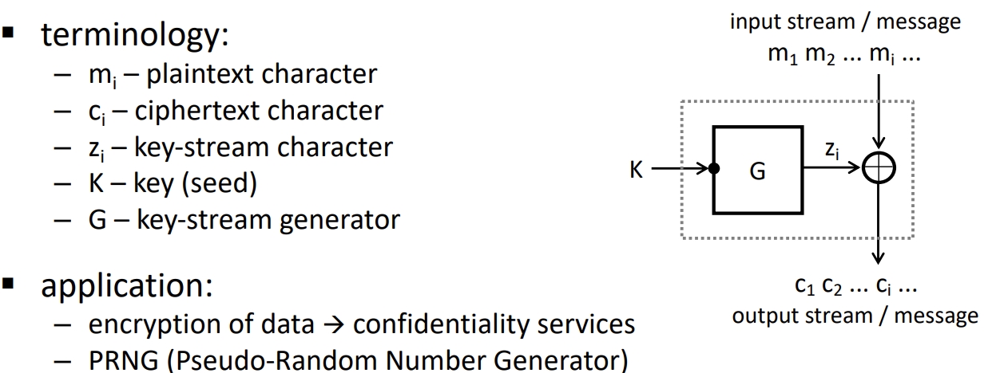

### Why should the state space of a stream cipher be large?
    Különben a kulcssorozatban ismétlések fordulnak elő.

### What are the advantages of stream ciphers?
    Gyors. Kevés memória elég az információk és az algoritmus tárolására.

### What are the disadvantages of stream ciphers?
    Szinkronizáció szükséges a küldő és fogadó között. Nincs integritás védelem, a támadó módosíthatja az üzenetet és pontosan tudja ez milyen hatást vált ki, a fogadó nem biztos, hogy észreveszi a változtatást.

---

### How block ciphers work? What does it mean intuitively that a block cipher behaves like a random permutation?
    Bit-ek blokkján (általában 128 bit) működik. Az üzenet egyes blokkjait sorra egymás után titkosítja. Ha a kulcs ismeretlen, a kimenet (vagy annak része) megjósolhatatlan, még bemenet-kimenet párok ismeretében is.

### How block ciphers are constructed? What do we mean by an avalanche effect?
    Több rétegnyi egyszerű, ám nem biztonságos műveletet használnak, amiknek az eredménye egy biztonságos megoldás lesz. Az avalanche effektus azt jelenti, hogy a bemenet egy bit-jének megváltoztatása minden kimeneti bit 0,5 valószínűségű változását vonja maga után.

### What is the Kerckhoff principle? Why is it important?
    Azt jelenti, hogy egy kiptografikus rendszert úgy kell felépíteni, hogy akkor is biztonságos maradjon, ha a működése ismert (a kulcs ismeretlen). Emiatt egyedül a kulcs titokban tartására kell figyelni, az algoritmus lehet ismert.

### What are the standard attacker models in case of encryption?
    A támadás célja, a támadó rendelkezésére álló információk és a támadás mérőszámai.

### How does exhaustive key search work? What is its complexity?
    Brute force. Az összes lehetőség végigpróbálása. k hosszú kulcs esetén a komplexitás 2^(k-1).

### For a cipher to be secure, is it sufficient to have a large key size?
    Igen, az előző alapján a 128 bit hosszú kulcs már elég nagy.

### What is double encryption and how does the meet-in-themiddle attack work on it?
    Kétszer kódolunk egy blokkot különböző kulcsokkal. Ez támadható, ha tudunk egy bemenet(X) kimenet(Y) párt és két irányból próbálkozunk. Vagyis nézzük az EK1(X) és DK2(Y) lehetősége és ahol egyezést találunk, ott megkapjuk a kulcsokat.

### How does 3DES work?
$Y = DES_{K3}(DES^{-1}_{K2}(DES_{K1}(X)))$

### What are the main block cipher selection criteria?
    Effektivitás, biztonság és az elvárt követelményekkel való egyezés.

---

### Why do we need block encryption modes?
    Általában az üzenet nem ugyanolyan hosszú mint a blokk.

### What is the main weakness of the ECB mode? 
    Két ugyanolyan blokk kódolva is ugyanazt adja, vagyis nem rejti el az üzenet mintáit.

### How do the CBC and the CTR modes work and what are their main properties?
CBC:

    Az üzenet hossza nem biztos, hogy többszöröse egy blokk hosszának, ezeket padding-el töltjük fel, fontos, hogy ezek a fogadó által felismerhetőek legyenek.
CTR:
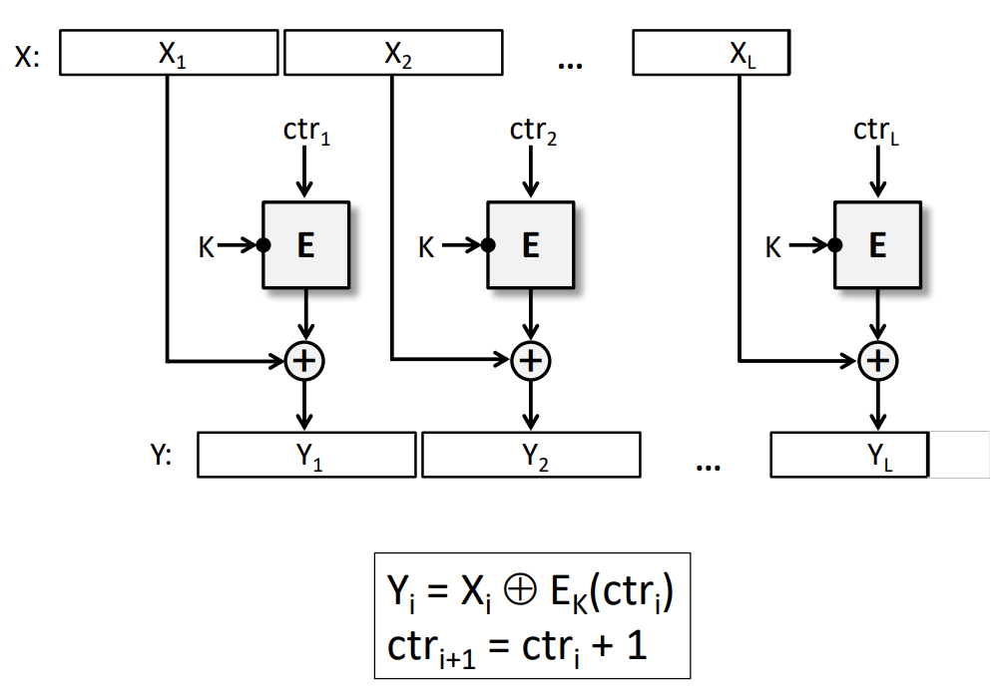
    Nincs integritás védelem, nem növeli a kódolás az üzenet hosszát.

### How to generate unpredictable IVs for CBC?
    Egy kriptografikus random szám generátor kimenete.

### How to generate non-repeating counters for CTR?
    Egy üzeneten belül ne ismétlődjenek. A counter blokkot két részre osztjuk. A második hossza b az elsőé n-b, ahol n a blokkok száma. Az első egy egyedi üzenet ID, ami minden üzenettel növekedik. A második blokkonként növekedik.

---

### What is the basic idea behind the content leak problem?
    Ha két kódolt blokk egyezik, akkor a támadó meg tudja mondani az eredeti blokkok összegét. Ez akkor hasznos, ha valamelyik eredeti blokk részben vagy egészben ismert.

### When do we expect to have at least two identical ciphertext blocks in a CBC encrypted message? (length of message as a function of the block length)
$Pr(Y_i = Y_j) = 1-P_k$, ahol $P_k = \frac{N-1}{N} \frac{N-2}{N} ... \frac{N-k+1}{N}$

### What attacker model does the padding oracle attack belong to?
    Van egy kódolt blokkunk. Van egy Oráculum, ami ismeri a kulcsot, dekódolja amit kap, ellenőrzi a blokk végi padding-et és visszaadja, hogy a padding hibás vagy helyes.

### What is the main idea of the padding oracle attack?
    Veszünk egy blokkot (pl.: 000..00) és ezt beadjuk az orákulumnak, valszeg hibás paddinget jelez. Elkezdjük növelni a blokk értékét. Egyszer csak helyes lesz a padding. Ha hosszabb a padding akkor hasonlóan kiderítjük a hosszát. Illy módon mindenig a helyes padding-et keresve megkapjuk a blokkot.

### How we can prevent padding oracle attacks?
    Kerüljük el, hogy információ szivárogjon ki a padding helyességéről.

### Why are predictable IVs in CBC mode dangerous?
    Ha van egy orákulumunk, akkor próbálgatással megkaphatjuk az eredeti blokkokat.

### What could be the problem with repeated guessing of a plaintext block in practice?
    Valóságban a nagy blokkméret miatt a próbálozás nem megoldható.

### When can the guessing attack that exploits predictable IVs still work?
    Ha a blokk egy része már ismert és csak a maradékot kell próbálgatni.

---

### What is a cryptographic hash function?
    Bármilyen bemenethez rendel egy fix méretű kimenetet.

### What are the 3 main security requirements on crypto hash functions?
    Gyorsan számolható, egy bemenethez nagyon nehezen (vagy egyáltalán ne) lehessen találni másik bemenetet amihez ugyanaz a kimenet tartozik, a kimenetből ne lehessen megmondani a bemenetet.

### What is the Birthday Paradox and how is it related to hash functions?
    Ha egy N elemű halmazból véletlenszerűen választunk (választás után helyettesítődnek), akkor gyök N választás után nagy valószínűséggel találunk ismétlődő elemet. Brute force támadás esetén gyök N ellenőrzés után nagy valószínűséggel sikeres lesz. 

### How iterative hash functions work? (scheme)
    A bemenetet blokkokra osztja.
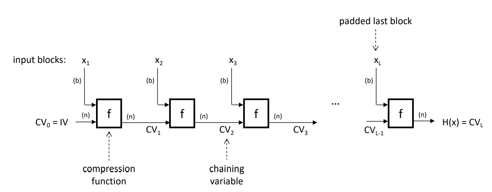

### Describe the so called ”sponge construction”!
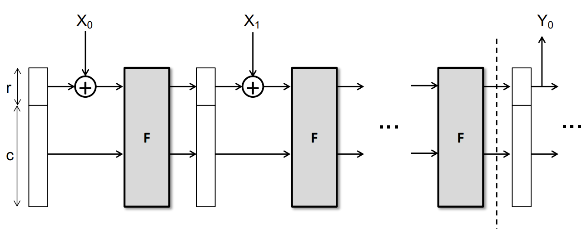

### How are MAC functions used to ensure message authentication? (basic operating principle)
    Hasonló mint a hash, csak van egy plusz kulcs, bemeneti paraméterként. A fogadó ellenőrizheti valóban attól jött-e az üzenet akitől várta. 

### What attacker models do you know for MAC functions?
    possible objectives: készített üznetekből a kulcs kitalálása
    available knowledge: ismert MAC-üzenet párokból MAC választott üzenethez

### What are the desired security properties of MAC functions?
    Nehezen lehessen kitalálni a kulcsot
    Ismert MAC-üzenet párokból nehezen lehessen saját üzenethez MAC-et kreálni

### How do brute force attacks against MAC functions work?
    Ismert MAC-üzenet párokra próbálgatással keressük a kulcsot

### What is the meet-in-the-middle attack in the context of MAC functions?
    Ha a session elején egy imsert üzenetet küldenek, akkor a támadó ebből az üzenetből előre legenerál sokat, különböző kulcsokkal. Az üzenet küldésekor ellenőrzi a generát titkosításokkal való egyezést. Egyezés esetén megvan a kulcs, egyébként később újra próbálkozik.

### How does HMAC work? (scheme)
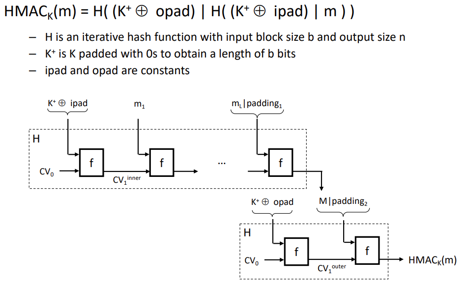

### How does CBC-MAC work (scheme), and what is its potential problem? How to strengthen the CBC-MAC scheme?
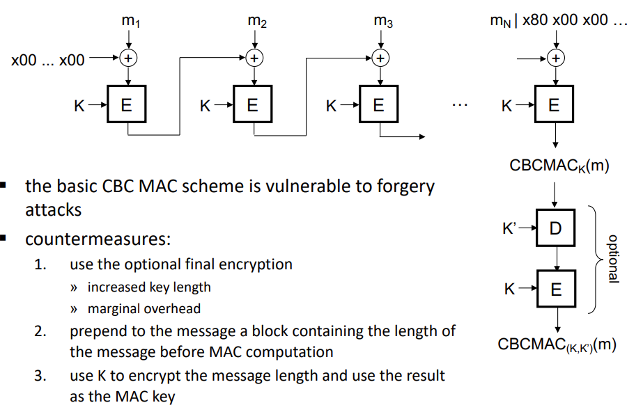

### How does the CMAC scheme work?
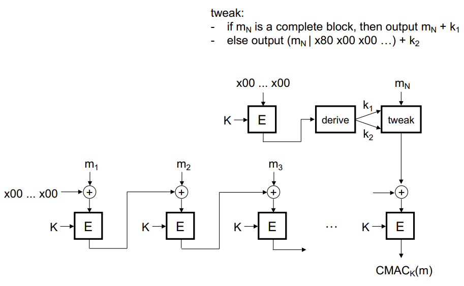

### What is authenticated encryption? What are the 2 main approaches to achieve authenticated encryption?
    Egyszerre garantálja a confidentiality, integrity és authenticity az üzenetnek. 
    Különböző kombinációi kódoló és MAC függvényeknek.
    Specializált autentikált kódoló módszerek használata.

### Describe the generic combinations of encryption and MAC! Which one is the most secure?
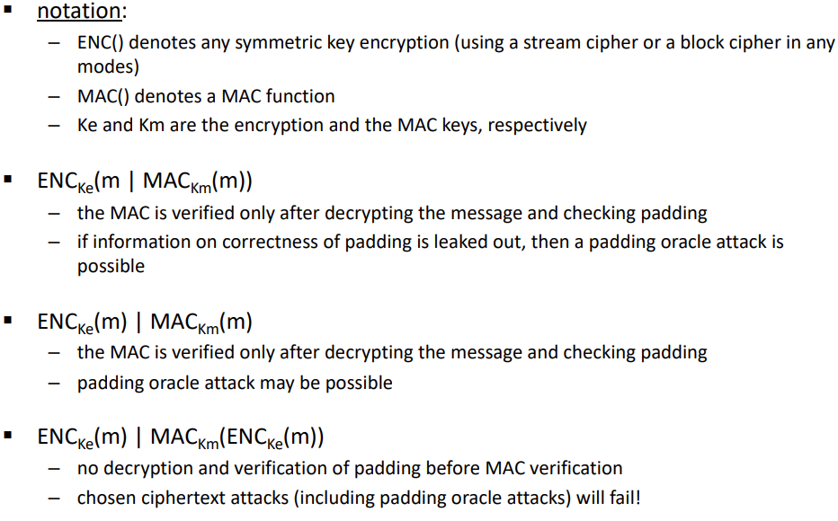

### How does the CCM authenticated encryption scheme work?
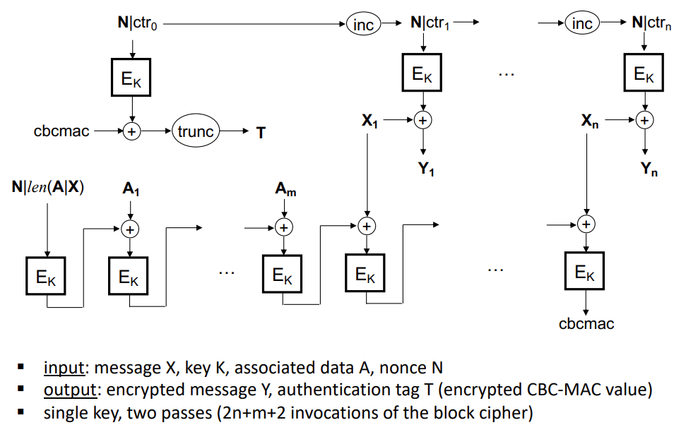

### What are the advantages of special authenticated encryption schemes?
    Egyetlen kulcsot használnak. Effektívek. Chosen-chipetext támadások ellen véd.

---

### How can message sequence numbers be used for replay detection?
    A szekvencia számoknak monoton növekednie kell. 

### What is the difference between an explicit and an implicit message sequence numbering scheme?
    Explicit tolerálja az üzenetek elvesztését, de a rossz számú üzeneteket eldobja. Implicit csak megbízható kommunikációs csatornán használható, ahol nincs csomag vesztés vagy sorrend módosulás, a pontos szám elvárt.

### How can replay protection be solved in an unreliable network?
    Egy ablakkal, amin belüli számok elfogadottak. Az ablakon kíül eső szekvencia számok eldobásra kerülnek.

---

### What security services does TLS provide?
    Egy biztonságos csatormát biztosít, általában web server és browser között (pl https).

### What are the TLS v1.2 sub-protocols, and how do they fit in the TCP/IP network stack?
    Handshake Protocol, Change Chiper Spec Protocol, Alert Protocol és TLS Record Protocol. A TCP föltött helyezkednek el.

### What are TLS sessions and connections? How are they related and what was the design motivation for this relationship?
    Session egy biztonságos kapcsolat a server és a kliens között. Egy session tartalmahózhat több connecton-t is. 

### How does the TLS v1.2 Record Protocol work?
    Tartalmazza a kódolt üzenetet, a MAC-et és padding-ot. A padding véletlen hosszú.

### What are the main ideas of the following attacks on the Record Protocol?
    ...

---

### What is the basic idea of public-key cryptography?
    A titkostáshoz a feladó privát és a cél publikus kulcsa szükséges. Így a fogadó biztos lehet benne, hogy az üzenetet a feladó titkosította. A visszafejtéshez a küldő publikus és a fogadó privát kulcsa szükséges.

### What is a digital envelop? (hybrid approach)
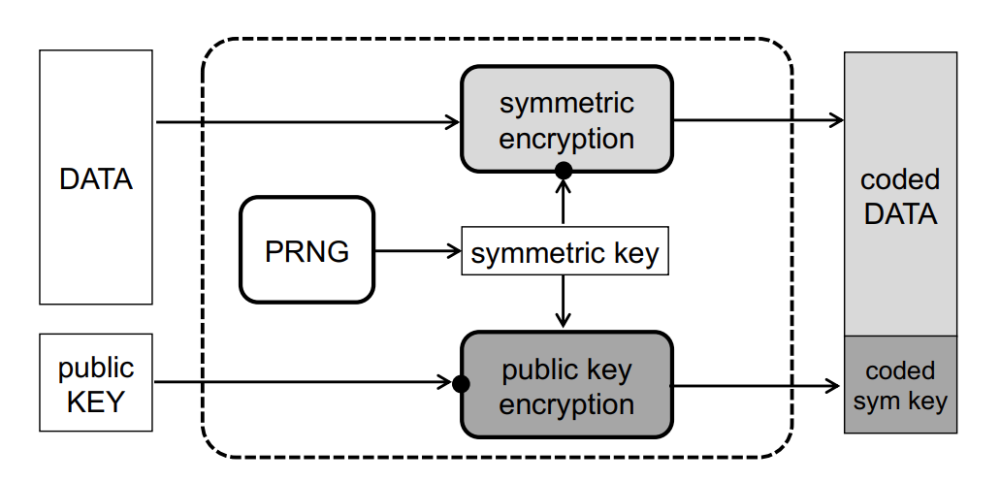

### What hard problems is the security of public-key crypto schemes related?
    Olyan problémák, amikre nem ismert polinom idejű algoritmus. Pl. prímfelontás vagy logaritmus számolás

### What is semantic security? How to achieve it?
    Két különböző üzenet kódolt változatairól nem lehet egyértelműen megmondani melyik melyikhez tartozik. A megoldás probabilistic encryption, ami alapján a kódolt eredmény egy ismeretlen random értéktől függ.

### How does the RSA algorithm work?
    A kulcs generálásához két nagy prímszámot (p,q) használ. A kódolt üzenet előáll a üzenet e-dik hatáványának n. modolusaként. Ahol n a választott prímek szorzata, e pedig egy választott szám 2 és (p-1)(p-q) között. Dekódolásnál az üzenet a kodolt üzenet d-edik hatványának n-edik modolusa.

### Which hard problems RSA is related to?
    Prímtényezős felbontás

### What are practical issues to consider in case of RSA?
    A gyakorlatban ez a kódolás determinisztikus.

### What is PKCS #1 ?
    Kiegészíti az RSA-t véletlen faktorral. Sérülékeny a adaptive chosen ciphertext támadásokkal szemben.

### How does the ElGamal encryption work?
    p egy nagy prím, q p-1 prím osztólya, ezekből generáljuk a kulcsokat. 

### What is Elliptic Curve Cryptography (ECC) in a nutshell?
    Geometriai görbék segítségével működik, amik a Weierstrass egyenletre illeszkednek. Pontokkal végez műveleteket. 

### What are the advantages of ECC?
    Kevesebb paraméter. Gyorsabb.

### How does the ElGamal algorithm work over elliptic curves?
    Egy eliptikus görbe az aláfekvő csoport. Modolus helyett pontokon végez műveleteket.

### What is a digital signature scheme?
    Hasonlít a MAC-hez, de a fogadó által nem megkonstruálható és harmadik fél által igazolható. Authentication és integrity védelem. 

### What is the key difference between MAC functions and digital signatures? What additional security function do signatures provide?
    ua. elöbbi

### What attacker models do exist for digital signature schemes?
    capabilities of the attacker: 
    objectives of the attacker:

### What is the hash-and-sign paradigm? 
    Nem az üzenetet írja alá, hanem az üzenet hash-ét. Dekódolás verifikálható.

---

### What is the purpose of key exchange protocols?
    Az érintett felek között titkos információcsere a kulcsról

### What are the design objectives of key exchange protocols?
    Csak a felek tudják a kulcsot. Mindketten legyenek tisztában a protokol sikeres végrahajtásában. Mindkét fél a legfrissebb kulcsot birtokolja. 

### What are the two main types of key exchange protocols?
    key agreement protocols: A kulcs közösen lett megalkotva
    key transport protocols: Az egyik fél létrehozza a kulcsot és biztosnágosan eljuttatja a másiknak.

### What do we assume about the attacker?
    A támadó lehallgatta a protokolt.

### What kind of attacks do you know against key exchange protocols?
    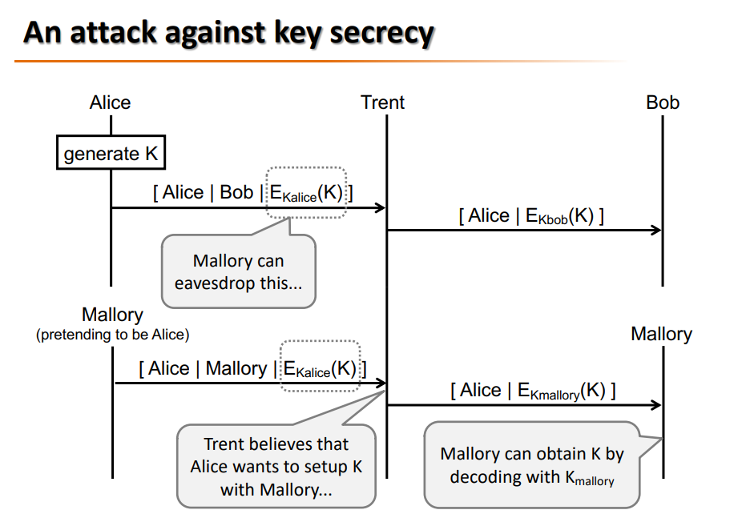
    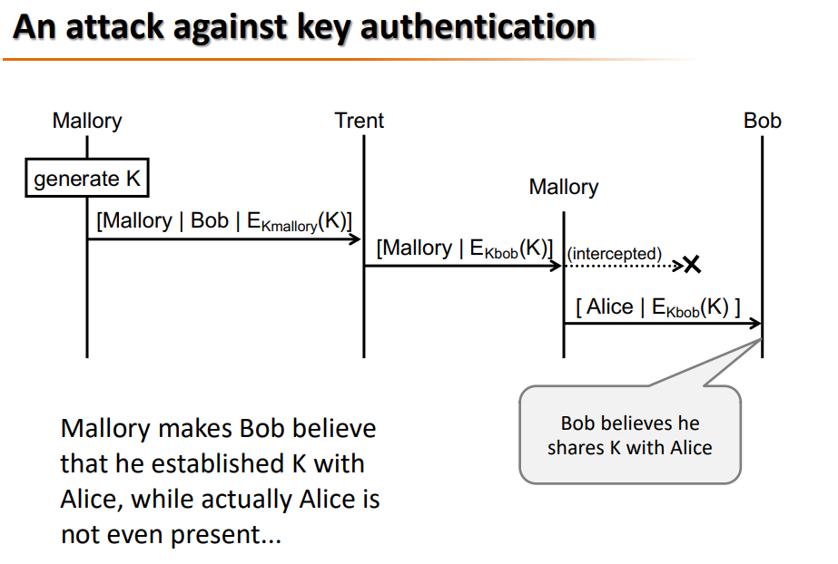

### How do key transport protocols ensure the secrecy of the established key?
    Cél: Amikor a protokoll sikeresen lefut, más feleknek nem szabad megtudnia a létrehozott kulcsot.
    Üzenetek sérthetetlenségét kell biztosítani. MAC érték használatával megakadályozható az üzenet módosítás és a más nevében üzenetek küldése. A MAC létrehozása az egyes felek aláírásával történik, így biztosítható, hogy az küldi, aki aláírja. Így nem tud a támadó Alice nevében magának üzenetet küldeni, hogy megszerezze a kulcsot.

### How is key authenticity achieved?
    Cél: Amikor protokoll sikeresen lefut, és mindkét fél azt gondolja, hogy a protokoll lefutása és a kulcs létrehozása után a másik féllel létesített kapcsolatot. A két oldalon matching protokoll futások vannak.
    Üzenetek sérthetetlenségét kell biztosítani. MAC érték használatával megakadályozható az üzenet módosítás és a más nevében üzenetek küldése. A MAC létrehozása az egyes felek aláírásával történik, így biztosítható, hogy az küldi, aki aláírja. Így nem tudja a támadó Bob nevében aláírni az üzenetet, hogy Bob azt higgye, Alice-cel beszél.

### What methods do you know for providing key freshness? Explain how they work, and what their advantages and disadvantages are!
    A felek által adott kontribúcióból számolódik valamilyen egyirányú függvénnyel. Mivel a függvény egyirányú, ezért nem található egy rögzített input mellé a másik input az output alapján. Ez alapján ha az egyik fél friss kontribúciót használ, akkor a kulcs is friss lesz.
    A frissességnek mindkét fél által megállapíthatónak kell lennie.

    - Időpecsétek használata:
    az egyik fél beleteszi a kulcs generálásakor az aktuális időpecsétet az üzenetbe, ezzel együtt generálódik a MAC, az a másik fél által ellenőrizhető.
    Előny: kevés üzenet
    Hátrány: Továbbra is lehetséges a visszajátszás az elfogadási ablakban, amikor a felek nem túl réginek ítélik az időpecsétet. Tehát a feleknek a replay üzeneteket ki kell szűrniük -> a felek emlékezhetnek az elfogadási időn belül kapott üzenetekre (mivel így csak limitált üzenetre kell emlékezni, ezért az üzenetek mentése most megengedhető). 
    Az óráknak szinkronizálva kell lenniük! A szinkronizálás is biztonsági feladat, ami nem triviális feladat (időszerverrel való kommunikáció időpecsétek nélkül).
    A késő és siető órák is gondot okozhatnak.
    - Véletlen nonce-ok használata:
    Frissen generált véletlen szám elküldése a harmadik félnek, aki generálja a kulcsot, és visszaküldi a feleknek, MAC-cel hitelesítve.
    Akkor fogadják el a felek a kulsot frissnek, ha a válaszüzenet bizonyos időablakon belül érkezik meg.
    Ha a MAC-ben benne van a véletlen szám, bizonyítja, hogy nem keletkezhetett korábban, mint a véletlen szám.
    Előny: nincs szükség órák szinkronizálására
    Hátrány: több üzenetből állnak, és ideiglenes állapotot kell tárolni a feleknek (melyik partnerrel milyen nonce-t használt), a nonce-nak nem predikálhatónak kell lennie

### What is perfect forward secrecy?
    Ha a felek törlik azokat a titkokat, amikre már nincs szüksége, akkor elvárható lehet, hogy ha egy támadó megszerez egy kulcsot, akkor azzal a korábbi üzeneteket nem tudja visszafejteni.

---

### Why do we need public key certificates?
    Hogy biztosak legyünk a publikus kulcsok helyességében/valódiságában.

### What essential elements does a public key certificate contain?
### Why should certificates have an expiration date?
### What could be reasons for revoking a certificate before it expires?
### What is a CA? What are its functions? Why do we trust CAs?
### What are the steps of the certificate life cycle?
### How are private keys stored and protected?
### How a hierarchical PKI operates?
### What is a certificate chain? How is it verified?
### Why and how are certificates revoked?

---

### Why do we need random numbers in cryptographic applications?
    A kulcsok és más paraméterek generálásához.

### What is the difference between a true random number generator and a pseudo-random number generator (PRNG)?
### What practical problems do PRNGs solve?
### What is the general structure of a PRNG?
### What do we assume about the attacker in case of PRNGs? (goals and capabilities)
### How does the Fortuna PRNG work? Why do we need to derive keys from an already random shared secret?
### How does the extract-then-expand key derivation approach work?
### How does HKDF implements the extract-then-expand approach?
### What is the basic problem we need to consider when deriving cryptographic keys from passwords?
### In case of password based key derivation, what do we mean by "stretching" and "salting"? Why is it advantageous to apply them?
### How does PBKDF2 work?
### What are the advantages and disadvantages of an interactive password authenticated key exchange protocol with respect to an off-line password based key derivation function?
### How does Encrypted Key Exchange (EKE) work? How does it prevent dictionary attacks on the password?
### What is the key advantage of the Secure Remote Password (SRP) protocol compared to EKE?

---

### What are the phases of the TLS v1.2 Handshake Protocol?
### What key exchange methods are supported by TLS v1.2? How do they work?
### How are ciphersuites negotiated in the TLS handshake?
### How is the server authenticated in the TLS handshake?
### What is the role of the Change_Cipher_Spec messages?
### How are connection keys derived from the session master secret?
### What is the role of the Finished messages and how are they constructed?
### Which parts of the handshake are kept when the parties create a new connection in an already existing session? What are the main ideas of the following attacks on the Handshake Protocol?
– Version rollback
– POODLE attack
– DROWN attack
– Dropping the Change Cipher Spec messages
– Key exchange confusion and the LOGJAM attack
### What are the main differences between the TLS v1.3 Handshake and the TLS v1.2 Handshake?
### How do the 1-RTT and 0-RTT handshakes work?
### What are the main lessons that we can learn from the history of TLS (attacks and re-designs)?

---

### What are the main security problems in wireless networks?
### Why undisclosed SSIDs and MAC filtering don’t provide security for WiFi?
### What are the main security objectives of WEP? How are they attempted to be achieved? Explain the details of WEP!
### Why does a group key need to be changed when someone leaves the group? How default WEP keys are updated in WEP?
### What are the flaws in WEP? Explain the details!
### How does authentication work in WPA and WPA2? What are the main protocols involved and how are they stacked on each other?
### What keys are derived after authentication?
### How are message confidentiality and integrity provided in WPA?
### How are weaknesses of WEP addressed in WPA? What weaknesses do still remain?
### How are message confidentiality and integrity provided in WPA2?
### What attacks against WPA2 do you know? Explain their main idea briefly!

