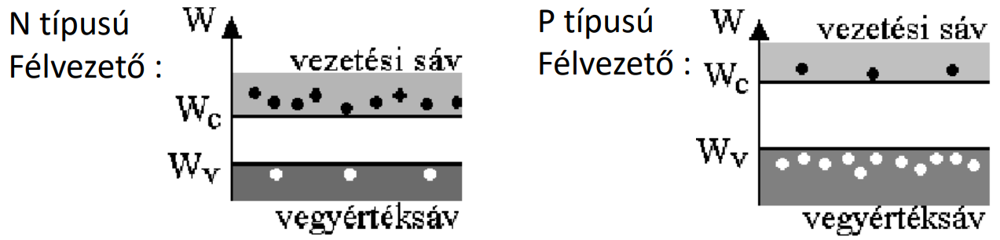
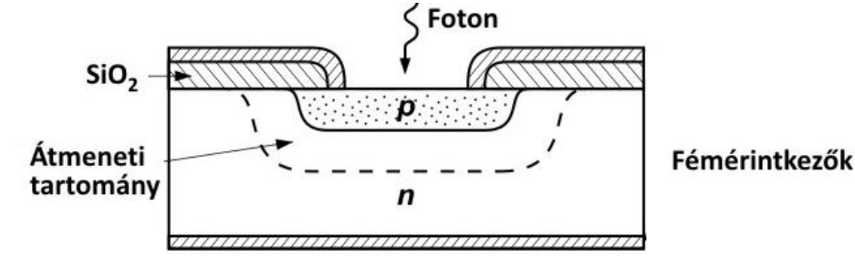
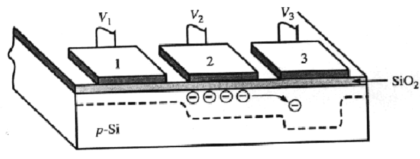

- [Digitális képalkotás fizikája](#digitális-képalkotás-fizikája)
  - [Elektromágneses sugárzás](#elektromágneses-sugárzás)
    - [Fotonok tulajdonságai:](#fotonok-tulajdonságai)
  - [Fotoelektromos kölcsönhatás](#fotoelektromos-kölcsönhatás)
  - [Fényérzékelés folyamata](#fényérzékelés-folyamata)
  - [Félvezetők](#félvezetők)
  - [Diódák](#diódák)
  - [Félvezető fotodiódák](#félvezető-fotodiódák)
  - [Charged-coupled Device (CCD)](#charged-coupled-device-ccd)
  - [Szcintilláció](#szcintilláció)
  - [Zaj](#zaj)
    - [Fotonok inherens zaja](#fotonok-inherens-zaja)
    - [Fényérzékeny MOS kondenzátor](#fényérzékeny-mos-kondenzátor)
    - [Analóg erősítő](#analóg-erősítő)
    - [A/D](#ad)
    - [Szcintilláció](#szcintilláció-1)
  - [Dinamika tartomány](#dinamika-tartomány)
    - [Full Well Capacity ($FWC[e^-]$)](#full-well-capacity-fwce-)
    - [Kiolvasási zaj ($RN[e^-]$)](#kiolvasási-zaj-rne-)
    - [Analóg digitális konverzió zaja ($ADCN[e^-]$)](#analóg-digitális-konverzió-zaja-adcne-)
    - [Dinamikatartomány bitekben](#dinamikatartomány-bitekben)
    - [P állítható (általában)](#p-állítható-általában)
  - [Egyéb fizikai hibák](#egyéb-fizikai-hibák)
    - [MOS kapacitás](#mos-kapacitás)
    - [Szisztematikus zaj](#szisztematikus-zaj)
- [Digitális képtárolás](#digitális-képtárolás)
  - [Képformátumok](#képformátumok)
      - [Veszteségmentes tárolás](#veszteségmentes-tárolás)
      - [Veszteséges tárolás](#veszteséges-tárolás)
    - [Lempel-Ziv-Welch kódolás (LZW)](#lempel-ziv-welch-kódolás-lzw)
    - [BMP (Bitmap Image)](#bmp-bitmap-image)
    - [TIFF (Tag Image File Format)](#tiff-tag-image-file-format)
    - [GIF (Graphics Interchange Format)](#gif-graphics-interchange-format)
  - [Ellenőrző kérdések](#ellenőrző-kérdések)

  

# Digitális képalkotás fizikája

Jelforrások:
- Fény
  - Látható, Röntgen, Gamma
- Hang
  - Ultrahang

## Elektromágneses sugárzás

Egyszerre változik az elektromos és mágneses tér. Vektoraik egymásra és a haladás irányár merőlegesek.

### Fotonok tulajdonságai:
- nyugalmi tömege 0
- állandó sebesség
- $$ E = h * {c \over \lambda} = h * f$$
  - h: [Planck-állandó](https://hu.wikipedia.org/wiki/Planck-%C3%A1lland%C3%B3)
  - c: fénysebesség
  - f: frekvencia
  - $\lambda$: hullámhossz
- a fény kvantuma (legkisebb egysége)
- polarizáció
- energiája meghatározza hogyan lép kölcsönhatásba atomokkal

## Fotoelektromos kölcsönhatás

__Foton rugalmatlanul ütközik elektronnal__
aminek hatására az elektron kilökődik az elektronhélyról.

$$ E_f = E_{ke} + E_{me} $$
$E_{ke}$: elektron töltési energiája, $E_{me}$: fotoelektron mozgási energiája

__Annal valószínűbb minél kisebb a fotoelektron mozgási energiája__
- nem lehet negatív
- nagy rendszámú elemben (Z), nagyobb a kötési energia
- minél távolabb van az atommagtól, a kötési energia annál kisebb
- Gyakoriság: $\alpha({Z \over E_f})^3$

## Fényérzékelés folyamata
1. fény
2. fotodióda (fotonból áram)
3. kondenzátor (töltés gyűjtése)
4. analóg erősítő
5. A/D átalakító
6. digitális feldolgozás

## Félvezetők

Lehetséges energiájuk diszkrét halmazt alkot, az elektronok sávokban helyezkednek el.

Legfelül **vezetési sáv**: elektron többlet

Alatta **vegyérték sáv**: lyuk (nincs elektron) többlet

Mozgás a két sáv között.

## Diódák

Egymés mellett egy P és egy N félvezető:

Anódtól a katód felé folyik az áram, ha $U_p > U_n + 0.7V$, egyébként is folyok áram, de a feszültségtől függetlenül kisebb (sötét áram).

## Félvezető fotodiódák

Átmeneti tartományba eső foton hatására keletkező töltéshordozók okozta áram  érésén alapulnak.

- félvezetőtől függ, hogy milyen energiájú fotonokat érzékel
- fotonok számlálása
- fényelektromos hatás
- az átmeneti tartományba becsapódó fotonok által keltett fotoelektronok áramot generálnak

## Charged-coupled Device (CCD)

**MOS kondenzátor**okból állnak:

- felépítése
  - elektróda (fém) - pozitív töltés
  - szigetelő
  - P félvezető
  - N félvezető - negatív töltés
- foton hatására (fotoelektromos kölcsönhatás) a P félvezetőben egy elektron és egy lyuk keletkezik
- ha elegendő a feszültségkülönbség, akkor a lyuk az N félvezető felé, az elektron pedig az elektróda felé indul

**Három darab MOS kondenzátor szükséges egy pixelhez**.

A kondenzátor hármasok egy négyzetrácson helyezkednek el. Az elektródákra kapcsolt feszültségekkel a töltéseket shiftelni lehet.

## Szcintilláció

Sugárzás gerjeszti a szcintillátor anyagot, ami ennek hatására fényt bocsát ki.

- látható / detektálható fotonokat szeretnénk generálni
- fotoelektromos kölcsönhatás
- nagyobb energiájú fotonokra érzéketlen
- anyag:
  - nagy rendszám &rarr; gyakori kölcsönhatás
  - elég vastag
- anyag mögé helyezett detektor érzékeli a nagy energiájú fotonokat

## Zaj

### Fotonok inherens zaja
- fotonok modellezése ergodikus Poisson folyamattal
- $$ E \{ X \} = Q$$
  $$ p \{ X = k \} = {{\lambda^k exp(-\lambda)} \over {k!}} $$
### Fényérzékeny MOS kondenzátor
- sötét áram: kaibrációval kompenzálható
- előző felvétel beégése: ha kevés idő telik el felvételek között
### Analóg erősítő
- erősítőből származó zaj

### A/D
- A/D kvantálás zaja: egyenletes eloszlású
### Szcintilláció
- szcintilláció zaja

## Dinamika tartomány

### Full Well Capacity ($FWC[e^-]$)
- P-SI réteg, csak véges számú elektront tud tárolni
- ~5E4 elektron a mai érzékelőknél
- Orvosi berendezéseknél E5 nagyságrendű elektron

### Kiolvasási zaj ($RN[e^-]$)
- Kalibrált MOS kondenzátorok zaja
- Ideálisan E-1 nagyságrendű

### Analóg digitális konverzió zaja ($ADCN[e^-]$)
- általában kisebb mint E-5

### Dinamikatartomány bitekben
- $$ D = log_2({{{FWC} / {P} } \over {P * RN + ADCN}}) $$
- P: analóg erősítő erősítése

### P állítható (általában)
- analóg erősítő erősítése
- A/D konverzió: P=1, FWC adja a macimális kimenetet
- orvosi eszközöknél kis tartományban állítható
- P>1 esetén romlik a dinamika, de kevesebb foton esetén is kihasználhatjuk az A/D átalakító teljes tartományát
- Fényképezőgépeknél az erősítést ISO P*100 alakban állítjuk

## Egyéb fizikai hibák

### MOS kapacitás
- halott pixel, mindig sötét
- meleg pixel, mindig telített
- szomszédos értékekből interpolálhatóak

### Szisztematikus zaj
- detektorok több blokkból állnak
- eltérő hibájú A/D konverter, illetve analóg erősítő
  - kompenzálni kell

  

# Digitális képtárolás

## Képformátumok

#### Veszteségmentes tárolás
- pontosan visszaállítható az eredeti kép
- BMP, PNG, (TIFF), JPEG2000
  
#### Veszteséges tárolás
- nem állítható vissza a teljes információ
- JPEG, JPEG2000, Fraktál tömörítés
- kisebb hely

### Lempel-Ziv-Welch kódolás (LZW)

- változó bithosszú kódolás
- lépései:
  1. szótárat inicializálunk minden lehetséges pixel intenzitással
  2. kikeressük a kódolni kívánt sorozat azon leghosszabb eddig még nem kódolt prefixét (W), mely már szerepel a szótárban (k kóddal)
  3. hozzátoldjuk a tömörített kép végéhez k-t, majd bővítjük a szótárat [W|a]-val, ahol a a tömörítendő bitfolyam W utáni első eleme
  4. második lépés ismétlése
  - k-t annyi biten ábrázoljuk, amennyin lehet az összes kódot, ezért változó hosszúságú
- angol szövegeknél 50% képeknél 75% lesz a tömörített file mérete az eredetihez képest

### BMP (Bitmap Image)
- összes képpont intenzitásának szerializációját tárolja
- adatokat LZW tömörítheti

### TIFF (Tag Image File Format)
- különböző színábrázolási és tömörítési módok
- több réteget, rétegek átlátszóságát is kezeli
- LZW / (Huffman) Futáshossz / JPEG kódolás

### GIF (Graphics Interchange Format)
- legfeljebb 8 bites képek
- LZW veszteségmentes tömörítés
- animált képek

## Ellenőrző kérdések
