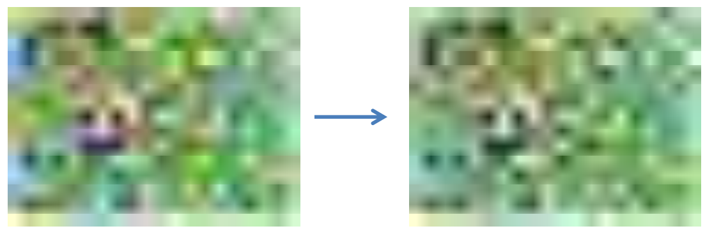

- [Digitális képalkotás fizikája](#digitális-képalkotás-fizikája)
  - [Elektromágneses sugárzás](#elektromágneses-sugárzás)
    - [Fotonok tulajdonságai:](#fotonok-tulajdonságai)
  - [Fotoelektromos kölcsönhatás](#fotoelektromos-kölcsönhatás)
  - [Fényérzékelés folyamata](#fényérzékelés-folyamata)
  - [Félvezetők](#félvezetők)
  - [Diódák](#diódák)
  - [Félvezető fotodiódák](#félvezető-fotodiódák)
  - [Charged-coupled Device (CCD)](#charged-coupled-device-ccd)
  - [Szcintilláció](#szcintilláció)
  - [Zaj](#zaj)
    - [Fotonok inherens zaja](#fotonok-inherens-zaja)
    - [Fényérzékeny MOS kondenzátor](#fényérzékeny-mos-kondenzátor)
    - [Analóg erősítő](#analóg-erősítő)
    - [A/D](#ad)
    - [Szcintilláció](#szcintilláció-1)
  - [Dinamika tartomány](#dinamika-tartomány)
    - [Full Well Capacity ($FWC[e^-]$)](#full-well-capacity-fwce-)
    - [Kiolvasási zaj ($RN[e^-]$)](#kiolvasási-zaj-rne-)
    - [Analóg digitális konverzió zaja ($ADCN[e^-]$)](#analóg-digitális-konverzió-zaja-adcne-)
    - [Dinamikatartomány bitekben](#dinamikatartomány-bitekben)
    - [P állítható (általában)](#p-állítható-általában)
  - [Egyéb fizikai hibák](#egyéb-fizikai-hibák)
    - [MOS kapacitás](#mos-kapacitás)
    - [Szisztematikus zaj](#szisztematikus-zaj)
- [Digitális képtárolás](#digitális-képtárolás)
    - [Veszteségmentes tárolás](#veszteségmentes-tárolás)
    - [Veszteséges tárolás](#veszteséges-tárolás)
  - [Lempel-Ziv-Welch kódolás (LZW)](#lempel-ziv-welch-kódolás-lzw)
  - [BMP (Bitmap Image)](#bmp-bitmap-image)
  - [TIFF (Tag Image File Format)](#tiff-tag-image-file-format)
  - [GIF (Graphics Interchange Format)](#gif-graphics-interchange-format)
  - [PNG (Portable Network Graphics)](#png-portable-network-graphics)
    - [PNG tömörítése - szűrés](#png-tömörítése---szűrés)
    - [PNG tömörítése - Deflate](#png-tömörítése---deflate)
  - [JPEG (Joint Photographic Experts Group)](#jpeg-joint-photographic-experts-group)
    - [Veszteséges JPEG tömörítés](#veszteséges-jpeg-tömörítés)
    - [Veszteséges JPEG artifaktumai](#veszteséges-jpeg-artifaktumai)
  - [DCM (Digital Imaging and Communications in Medicine)](#dcm-digital-imaging-and-communications-in-medicine)
- [Ellenőrző kérdések](#ellenőrző-kérdések)
  - [Mit jelent a fény kettős természete (hullámmozgás és kvantumelméleti megközelítés). A fénynek, mint elektromágneses sugárzásnak milyen tulajdonságait ismeri? Mitől függ egy foton energiája? Ez mit befolyásol orvosi képalkotás során?](#mit-jelent-a-fény-kettős-természete-hullámmozgás-és-kvantumelméleti-megközelítés-a-fénynek-mint-elektromágneses-sugárzásnak-milyen-tulajdonságait-ismeri-mitől-függ-egy-foton-energiája-ez-mit-befolyásol-orvosi-képalkotás-során)
  - [Ismertesse a fényérzékelés folyamatát! Hogyan működnek a félvezetők? Mit jelentenek az alábbi fogalmak: vegyértéksáv, vezetési sáv, tiltott sáv, lyuk, elektron, N típus, P típusú félvezető? Hogyan épülnek fel és hogyan működnek a fényérzékeny MOS kapacitások?](#ismertesse-a-fényérzékelés-folyamatát-hogyan-működnek-a-félvezetők-mit-jelentenek-az-alábbi-fogalmak-vegyértéksáv-vezetési-sáv-tiltott-sáv-lyuk-elektron-n-típus-p-típusú-félvezető-hogyan-épülnek-fel-és-hogyan-működnek-a-fényérzékeny-mos-kapacitások)
  - [Hogyan épülnek fel és hogy működnek a CCD érzékelők? Mit nevezünk szcintillációnak és mikor van rá szükség? Hogyan működnek és hogyan épülnek fel a látható fotonoknál nagyobb energiájú fotonokra (pl. uv, röntgen, gamma sugarak) érzékeny detektorok?](#hogyan-épülnek-fel-és-hogy-működnek-a-ccd-érzékelők-mit-nevezünk-szcintillációnak-és-mikor-van-rá-szükség-hogyan-működnek-és-hogyan-épülnek-fel-a-látható-fotonoknál-nagyobb-energiájú-fotonokra-pl-uv-röntgen-gamma-sugarak-érzékeny-detektorok)
  - [Mit nevezünk képalkotás során inherens zajnak. Mi okozza? Mekkora a „mértéke”? Mit értünk egy képalkotó rendszer dinamika tartománya alatt? Értelmezze az alábbi összefüggést: $D = log_2((FWC / P)/(P*RN +ADCN))$. Tipikusan milyen zajok terhelik a képalkotás során rögzített képeket.](#mit-nevezünk-képalkotás-során-inherens-zajnak-mi-okozza-mekkora-a-mértéke-mit-értünk-egy-képalkotó-rendszer-dinamika-tartománya-alatt-értelmezze-az-alábbi-összefüggést-d--log_2fwc--pprn-adcn-tipikusan-milyen-zajok-terhelik-a-képalkotás-során-rögzített-képeket)
  - [Hogyan működik a Graphics Interchange Format alapú képtárolás? Ismertesse a Portable Network Graphics formátum során alkalmazott tömörítési eljárás főbb lépéseit!](#hogyan-működik-a-graphics-interchange-format-alapú-képtárolás-ismertesse-a-portable-network-graphics-formátum-során-alkalmazott-tömörítési-eljárás-főbb-lépéseit)
    - [Ismertesse a Joint Photographic Experts Group formátum tömörítő eljárásának főbb lépéseit. Milyen melléktermékeket okozhat ez a fajta tömörítő eljárás?](#ismertesse-a-joint-photographic-experts-group-formátum-tömörítő-eljárásának-főbb-lépéseit-milyen-melléktermékeket-okozhat-ez-a-fajta-tömörítő-eljárás)
  - [Ismertesse a DICOM szabvány képtárolásának főbb jellemzőit, valamint a szabvány általánosabb jellegét!](#ismertesse-a-dicom-szabvány-képtárolásának-főbb-jellemzőit-valamint-a-szabvány-általánosabb-jellegét)

  

# Digitális képalkotás fizikája

Jelforrások:
- Fény
  - Látható, Röntgen, Gamma
- Hang
  - Ultrahang

## Elektromágneses sugárzás

Egyszerre változik az elektromos és mágneses tér. Vektoraik egymásra és a haladás irányár merőlegesek.

### Fotonok tulajdonságai:
- nyugalmi tömege 0
- állandó sebesség
- $$ E = h * {c \over \lambda} = h * f$$
  - h: [Planck-állandó](https://hu.wikipedia.org/wiki/Planck-%C3%A1lland%C3%B3)
  - c: fénysebesség
  - f: frekvencia
  - $\lambda$: hullámhossz
- a fény kvantuma (legkisebb egysége)
- polarizáció
- energiája meghatározza hogyan lép kölcsönhatásba atomokkal

## Fotoelektromos kölcsönhatás

__Foton rugalmatlanul ütközik elektronnal__
aminek hatására az elektron kilökődik az elektronhélyról.

$$ E_f = E_{ke} + E_{me} $$
$E_{ke}$: elektron töltési energiája, $E_{me}$: fotoelektron mozgási energiája

__Annal valószínűbb minél kisebb a fotoelektron mozgási energiája__
- nem lehet negatív
- nagy rendszámú elemben (Z), nagyobb a kötési energia
- minél távolabb van az atommagtól, a kötési energia annál kisebb
- Gyakoriság: $\alpha({Z \over E_f})^3$

## Fényérzékelés folyamata
1. fény
2. fotodióda (fotonból áram)
3. kondenzátor (töltés gyűjtése)
4. analóg erősítő
5. A/D átalakító
6. digitális feldolgozás

## Félvezetők

Lehetséges energiájuk diszkrét halmazt alkot, az elektronok sávokban helyezkednek el.

Legfelül **vezetési sáv**: elektron többlet

Alatta **vegyérték sáv**: lyuk (nincs elektron) többlet

Mozgás a két sáv között.

## Diódák

Egymés mellett egy P és egy N félvezető:

Anódtól a katód felé folyik az áram, ha $U_p > U_n + 0.7V$, egyébként is folyok áram, de a feszültségtől függetlenül kisebb (sötét áram).

## Félvezető fotodiódák

Átmeneti tartományba eső foton hatására keletkező töltéshordozók okozta áram  érésén alapulnak.

- félvezetőtől függ, hogy milyen energiájú fotonokat érzékel
- fotonok számlálása
- fényelektromos hatás
- az átmeneti tartományba becsapódó fotonok által keltett fotoelektronok áramot generálnak

## Charged-coupled Device (CCD)

**MOS kondenzátor**okból állnak:

- felépítése
  - elektróda (fém) - pozitív töltés
  - szigetelő
  - P félvezető
  - N félvezető - negatív töltés
- foton hatására (fotoelektromos kölcsönhatás) a P félvezetőben egy elektron és egy lyuk keletkezik
- ha elegendő a feszültségkülönbség, akkor a lyuk az N félvezető felé, az elektron pedig az elektróda felé indul

**Három darab MOS kondenzátor szükséges egy pixelhez**.

A kondenzátor hármasok egy négyzetrácson helyezkednek el. Az elektródákra kapcsolt feszültségekkel a töltéseket shiftelni lehet.

## Szcintilláció

Sugárzás gerjeszti a szcintillátor anyagot, ami ennek hatására fényt bocsát ki.

- látható / detektálható fotonokat szeretnénk generálni
- fotoelektromos kölcsönhatás
- nagyobb energiájú fotonokra érzéketlen
- anyag:
  - nagy rendszám &rarr; gyakori kölcsönhatás
  - elég vastag
- anyag mögé helyezett detektor érzékeli a nagy energiájú fotonokat

## Zaj

### Fotonok inherens zaja
- fotonok modellezése ergodikus Poisson folyamattal
- 
 $$ E \{ X \} = Q$$
  $$ p \{ X = k \} = {{\lambda^k exp(-\lambda)} \over {k!}} $$
### Fényérzékeny MOS kondenzátor
- sötét áram: kaibrációval kompenzálható
- előző felvétel beégése: ha kevés idő telik el felvételek között
### Analóg erősítő
- erősítőből származó zaj

### A/D
- A/D kvantálás zaja: egyenletes eloszlású
### Szcintilláció
- szcintilláció zaja

## Dinamika tartomány

### Full Well Capacity ($FWC[e^-]$)
- P-SI réteg, csak véges számú elektront tud tárolni
- ~5E4 elektron a mai érzékelőknél
- Orvosi berendezéseknél E5 nagyságrendű elektron

### Kiolvasási zaj ($RN[e^-]$)
- Kalibrált MOS kondenzátorok zaja
- Ideálisan E-1 nagyságrendű

### Analóg digitális konverzió zaja ($ADCN[e^-]$)
- általában kisebb mint E-5

### Dinamikatartomány bitekben
- $$ D = log_2({{{FWC} / {P} } \over {P * RN + ADCN}}) $$
- P: analóg erősítő erősítése

### P állítható (általában)
- analóg erősítő erősítése
- A/D konverzió: P=1, FWC adja a macimális kimenetet
- orvosi eszközöknél kis tartományban állítható
- P>1 esetén romlik a dinamika, de kevesebb foton esetén is kihasználhatjuk az A/D átalakító teljes tartományát
- Fényképezőgépeknél az erősítést ISO P*100 alakban állítjuk

## Egyéb fizikai hibák

### MOS kapacitás
- halott pixel, mindig sötét
- meleg pixel, mindig telített
- szomszédos értékekből interpolálhatóak

### Szisztematikus zaj
- detektorok több blokkból állnak
- eltérő hibájú A/D konverter, illetve analóg erősítő
  - kompenzálni kell

  

# Digitális képtárolás

### Veszteségmentes tárolás
- pontosan visszaállítható az eredeti kép
- BMP, PNG, (TIFF), JPEG2000
  
### Veszteséges tárolás
- nem állítható vissza a teljes információ
- JPEG, JPEG2000, Fraktál tömörítés
- kisebb hely

## Lempel-Ziv-Welch kódolás (LZW)

- változó bithosszú kódolás
- lépései:
  1. szótárat inicializálunk minden lehetséges pixel intenzitással
  2. kikeressük a kódolni kívánt sorozat azon leghosszabb eddig még nem kódolt prefixét (W), mely már szerepel a szótárban (k kóddal)
  3. hozzátoldjuk a tömörített kép végéhez k-t, majd bővítjük a szótárat [W|a]-val, ahol a a tömörítendő bitfolyam W utáni első eleme
  4. második lépés ismétlése
  - k-t annyi biten ábrázoljuk, amennyin lehet az összes kódot, ezért változó hosszúságú
- angol szövegeknél 50% képeknél 75% lesz a tömörített file mérete az eredetihez képest

## BMP (Bitmap Image)
- összes képpont intenzitásának szerializációját tárolja
- adatokat LZW tömörítheti

## TIFF (Tag Image File Format)
- különböző színábrázolási és tömörítési módok
- több réteget, rétegek átlátszóságát is kezeli
- LZW / (Huffman) Futáshossz / JPEG kódolás

## GIF (Graphics Interchange Format)
- legfeljebb 8 bites képek
- LZW veszteségmentes tömörítés
- animált képek

## PNG (Portable Network Graphics)

- fejlettebb a GIF-nél
  - $\alpha$ csatornák
  - $\gamma$ korrekció
  - palettás / 16 bites szürkeskálás / 48 bites színábrázolás
  - fokozatos megjelenítés
- veszteségmentes két fázisú tömörítés
  1. fázis: egyszerű lináris szűrés alapú predikció
  2. fázis: Deflate (LZ77) tömörítés

### PNG tömörítése - szűrés

Predikció (jóslat) szűréssel. Csak a predikciós hibát kelljen tömöríteni.

A szűrők a bitsorozat előző pixeleinek intenzitása alapján számíott predikció és az aktuális pixel intenzitásának különbségét állítják elő.

Soronként eltérő szűrés alkalmazható. A szűrt kép minden pixele egász értékű kell, hogy legyen.

Cél a szűrt kép entrópiájának minimalizálása.

### PNG tömörítése - Deflate

Duplikált sorozatok keresése:
- LZ77-tel tömörít, véges hosszú pufferben keresi a tömöríteni kívánt bitsorozat leghosszabb prefixét
- pointer a minta előző előfordulására, hosszára, és az azt követő első intenzitás értékét tároljuk

[Huffman](https://hu.wikipedia.org/wiki/Huffman-k%C3%B3dol%C3%A1s) kódolással tömörítés.

Fokozatos megjelenítés: több menetben, több felbontásban küldi át a képet, de minden pixelt csak egyszer tartalmaz a file

## JPEG (Joint Photographic Experts Group)
- töb réteg, rétegenként különböző átlátszóság
- 16 bit / csatorna
- veszteséges és veszteségmentes is lehet
- webes képek, hobby fényképezők

### Veszteséges JPEG tömörítés

**1. Színtér transzformáció**

RGB &rarr; Y'CrCb konverzió
 - Y': $\gamma$ korrekció ([lásd](https://www.inf.u-szeged.hu/~tanacs/pyocv/gamma_korrekci.html)) utáni fényerő
 - Cr, Cb: vörös és kék árnyalat intenzitása

**1. Színcsatornák alul-mintavételezése**

  Cr és Cb csatornák alulmintavételezése, mivel Y'-re sokkal érzékenyebb az emberi szem (több pálcika mint csap).

**3. 8x8 méretű blokkok kialakítása**

8x8-as diszjunkt blokkokra bontjuk fel a csatornákat (külön-külön). Ha nem lefedhető a kép, akkor extrapoláljuk.

**4. Diszkrét Koszinusz Transzformáció (DCT)**

Minden 8x8 blokkot egyenként transzformálja.

[Ortonolmált](https://hu.wikipedia.org/wiki/Ortonorm%C3%A1lt_b%C3%A1zis), 2D koszinusz [wavelet](https://en.wikipedia.org/wiki/Wavelet) bázisokra vetít:

$$ f(u, v) = \alpha(u, v) * cos \left[ {{(2x + 1)u * \pi} \over {16}} \right] * cos \left[ {{(2y + 1)v * \pi} \over {16}} \right] $$

A transzformáció előtt 0 középpontúvá skálázzuk az intenzitásokat.

**5. Kvantálás**

Az ember érzékenyebb az alacsonyabb frekvenciákra. Képek esetén a jelenergia is nagyrészt alacsony frekvencián tárolódik, de persze a fázisérzékenység sem elhanyagolható.

$$ B_{(i, j)} = round \left( {{DCT\{I_{(i, j)}\}} \over {Q}} \right) $$

ahol:
- $B_{(i, j)}$: kvantálás utáni együtthatók
- $I_{(i, j)}$: $(i, j)$-edik blokkja az bemeneti képnek
- $Q$: szabványban meghatározott kvantálási mátrix skakárszorosa

Nem invertálható lépés. A tömörítés hatásfokát $Q$ elemeinek amplitúdója határozza meg.

**6. Kódolás**

Együtthatókat cikk-cakk trajektória (pálya) mentén sorosítja, majd ezen futáshossz és Huffman kódolást alkalmaz.

### Veszteséges JPEG artifaktumai

|Artifaktum|Leírás||
|:---|:---:|:---:|
|Ringing effektus|meredek átmenetű alul-áteresztés||
|Blokkosodás|blokkonkénti tömörítés miatt, Q-tól függ||
|Elszíneződés| durvább alulmintavételezés miatt ||
|Elmosás| tömörítés fokától függ||

## DCM (Digital Imaging and Communications in Medicine)

DCM, konténer formátum:
- tag-ekből áll
- a kép egy tag, amihez másik tag a formátum
- metaadatok

Leírja a file-ok archiválásának módját:
- szerverek hálózatának felépítése
- hálózat kommunikációs protokollja
- PACS (Picture Archiving and Communication System) ehhez igazodnak

Célja, hogy a felvételek ne vesszenek el és könnyen összehasonlíthatóak legyenek.

  

# Ellenőrző kérdések

## Mit jelent a fény kettős természete (hullámmozgás és kvantumelméleti megközelítés). A fénynek, mint elektromágneses sugárzásnak milyen tulajdonságait ismeri? Mitől függ egy foton energiája? Ez mit befolyásol orvosi képalkotás során?

xxx

## Ismertesse a fényérzékelés folyamatát! Hogyan működnek a félvezetők? Mit jelentenek az alábbi fogalmak: vegyértéksáv, vezetési sáv, tiltott sáv, lyuk, elektron, N típus, P típusú félvezető? Hogyan épülnek fel és hogyan működnek a fényérzékeny MOS kapacitások?

xxx

## Hogyan épülnek fel és hogy működnek a CCD érzékelők? Mit nevezünk szcintillációnak és mikor van rá szükség? Hogyan működnek és hogyan épülnek fel a látható fotonoknál nagyobb energiájú fotonokra (pl. uv, röntgen, gamma sugarak) érzékeny detektorok?

xxx

## Mit nevezünk képalkotás során inherens zajnak. Mi okozza? Mekkora a „mértéke”? Mit értünk egy képalkotó rendszer dinamika tartománya alatt? Értelmezze az alábbi összefüggést: $D = log_2((FWC / P)/(P*RN +ADCN))$. Tipikusan milyen zajok terhelik a képalkotás során rögzített képeket.

xxx

## Hogyan működik a Graphics Interchange Format alapú képtárolás? Ismertesse a Portable Network Graphics formátum során alkalmazott tömörítési eljárás főbb lépéseit!

GIF:
- 8 bites képek
- LZW veszteségmentes tömörítés:
  - szótárat inicializálunk minden lehetséges pixel intenzitással
  - kikeressük a kódolni kívánt sorozat azon leghosszabb eddig még nem kódolt prefixét (W), mely már szerepel a szótárban (k kóddal)
  - hozzátoldjuk a tömörített kép végéhez k-t, majd bővítjük a szótárat [W|a]-val, ahol a a tömörítendő bitfolyam W utáni első eleme
  - második lépés ismétlése
- animált is lehet

PNG tömörítés:
- szűrés:
  - predikciót hajtunk végre minden pixelre és az eltérést a jósolt és valós érték között tároljuk. A második lépésben ezt tömörítjük
- Deflate:
  - LZ77, 
  - Huffman kódolás

### Ismertesse a Joint Photographic Experts Group formátum tömörítő eljárásának főbb lépéseit. Milyen melléktermékeket okozhat ez a fajta tömörítő eljárás?

JPEF tömörítés:
- színtér transzformáció, ahol RGB-ből Y'CrCb-be konvertál.
- színcsatornák alulmintavételezése, mivel a fényerőre sokkal érzékenyebb az emberu szem
- blokkosítás, ahol 8x8-as diszjunk blokkok jönnek létre, ha szükséges extrapolálás után
- DCT (diszkrét koszinusz transzformáció), blokkonként, intenzitások 0 középpontú skálázása után:
  - $$ f(u, v) = \alpha(u, v) * cos \left[ {{(2x + 1)u * \pi} \over {16}} \right] * cos \left[ {{(2y + 1)v * \pi} \over {16}} \right] $$

- kvantálás:

  - $$  B_{(i, j)} = round \left( {{DCT\{I_{(i, j)}\}} \over {Q}} \right) $$

    - $B_{(i, j)}$: kvantálás utáni együtthatók
    - $I_{(i, j)}$: $(i, j)$-edik blokkja az bemeneti képnek
    - $Q$: szabványban meghatározott kvantálási mátrix skakárszorosa
- kódolás, amikor az együtthatókat cikk-cakk trajektória (pálya) mentén sorosítja, majd ezen futáshossz és Huffman kódolást alkalmaz.

melléktermékek:
- ringing effektus, ami a meredek átmenető aluláteresztés. 
- blokkosodás, amit a blokkonkénti tömörítés okoz és mértéke arányos a Q amplitúdójával. 
- elszíneződés, ami a Cr és Cb túlzótt alulmintavételezése miatt alakul ki. 
- elmosás, ami a tömörítés fokától függ.

## Ismertesse a DICOM szabvány képtárolásának főbb jellemzőit, valamint a szabvány általánosabb jellegét!

A szabványt leíró konténerek tag-ekből állnak. Egy képet egy tag-gel jelölünk, amihezt tartozik egy másik tag, ami megmondja a formátumát a képnek. Ezek mellet van lehetőség metaadatok tárolására is.

A szabvány meghatározza a képek archiválásának módját (hálózat felépítése, protokol). Ennek betartása lehetővé teszi, hogy a képek ne vesszenek el és könnyen össze lehessen hasonlítani őket.
