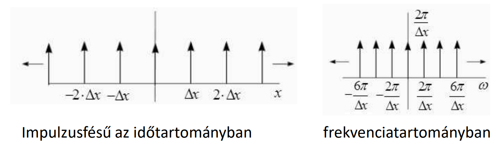
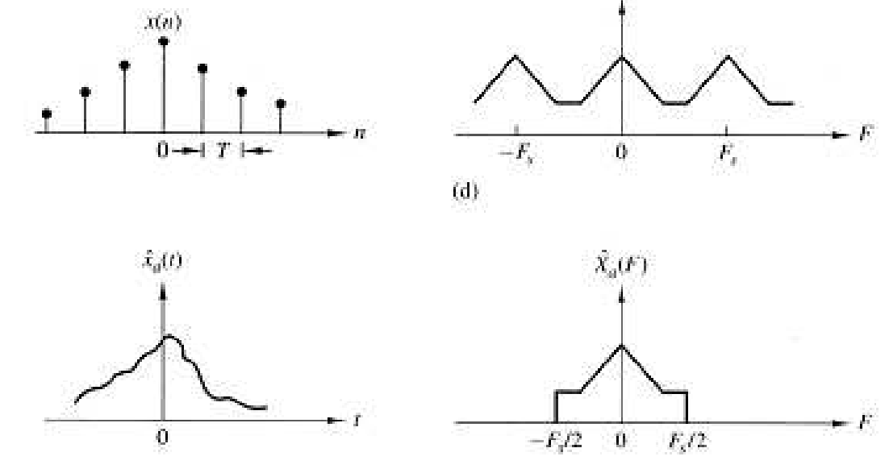
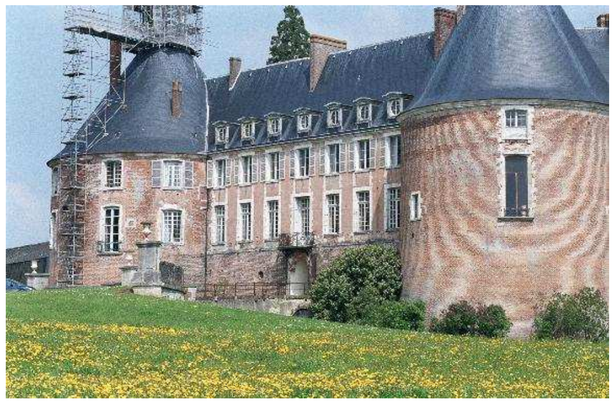

# Fourier térbeli analízis

## Folytonos Fourier Transzformáció

Lineáris transzformáció a véges energiáju, folytonos függvények tere felett.

$$ F(\omega) = FT \lbrace f \rbrace = \int_{-\infty}^{\infty} f(x)e^{-jx\omega}dx$$

$$ f(x) = FT^{-1} \lbrace F \rbrace = {{1}\over{2\pi}} \int_{-\infty}^{\infty} F(\omega)e^{jx\omega}d\omega $$

Tulajdonsága:
- **Konvolúciós tétel**: $(f*g) = FT^{-1}\lbrace (F\cdot G)(\omega) \rbrace$
- **Fordított konvolúció**: $((f\cdot g(\omega))) = {{1}\over{2\pi}}FT^{-1}\lbrace F*G \rbrace \big|_x$
- **Parseval tétel**: $E = \int_{-\infty}^{\infty}f^2(x)dx={{1}\over{2\pi}}\int_{-\infty}^{\infty}|F(\omega)|^2d\omega$
- Valós jel spektruma: $F(-\omega) = \overline{F(\omega)}$
- Páros, valós jel spektruma: $F(-\omega)=Re\lbrace F(-\omega) \rbrace = Re\lbrace F(\omega) \rbrace = F(\omega)$
- Páratlan, valós jel spektruma: $F(-\omega)=Im\lbrace F(-\omega) \rbrace \cdot j = Im\lbrace F(\omega) \rbrace \cdot (-j) =\overline{F(\omega)}$
- Periodikus jel spektruma diszkrét: $F(\omega) = 0$, ha $\omega \not ={k(2\pi \cdot f)}\big|_{k \in Z}$
- Ekvivalens egy unitér transzformációval
  - bijektivitás

## Folytonos Fourier Sorfejtés

Lineáris transzformáció a periodikus folytonos függvények tere felett.

$$ c_n = {{1}\over{T}} \int_{-{{T}\over{2}}}^{{{T}\over{2}}} f(x) \cdot e^{-jx2\pi{{n}\over{T}}}dx$$

ahol $n \in Z$

$$ f(x) = \sum_{n=-\infty}^{\infty}c_n \cdot e^{jx2\pi{{n}\over{T}}} $$

Kapcsolat a folytonos Fourier transzforációval:
- mintavételezi a spektrumot: $c_n \propto F(2\pi{{n}\over{T}})$
- peridodikus jel $\leftrightarrow$ diszkrét spektrum
- egyéb tulajdonságait örökli

## Diszkrét idejű Fourier Transzformáció (DTFT)

Adott egy mintavételezéssel előállt végtelen hosszú, abszolút összegezhető jel: $f[n]$

Definíció

$$ X(\omega) = \sum_{n=-\infty}^{\infty}x[n]\cdot e^{-j\omega n} $$

$$ x[n] = \frac{1}{2\pi}\int_{-\pi}^{\pi} X(\omega)e^{j\omega n} d\omega$$

Tulajdonságok:

- $n \in Z$, de $\omega \in R$
- $X(\omega + 2k\pi)\big|_{k\in Z} = X(\omega)$
- folytonos FT tulajdonságait örökli

## Matematikai mintavételezés, Folytonos Ft és DTFT kapcsolata

Végtelen impulzus fésű
- matematikai mintvételezés: folytonos jel elemenkénti szorzata az impulzusfésűvek
- időtartomány beli szorzás $\leftrightarrow$ spektrumok konvolúciója

## Mintavettt jel spektruma

$$ X_s(\omega) =\frac{2\pi}{\Delta x}X(\omega) *\sum_{k=-\infty}^{\infty} \delta \left( \omega-k\frac{2\pi}{\Delta x} \right) = \frac{2\pi}{\Delta x} \sum_k X \left( \omega-k\frac{2\pi}{\Delta x} \right)$$

- $\Delta x$: mintavételezések távolsága
- $X(\omega)$: folytonos idejű jel spektruma
- $X_s(\omega)$: mintavételezett jel spektruma

**Nyquist** (/nükviszt/ vagy /nájkviszt/) **mintavételi törvény**

$$ bw\lbrace x \rbrace < \frac12 f_s$$

$$ f_s = \frac1{\Delta x} $$
- Ha nem tartjuk be, alulmintavételezés: $K\cdot X_a(\omega) \not ={X(\omega)}$

Helyes mintavételezés interpretációja:

Alul mintavételezés interpretációja,
spektrum átlapolódása:

Spektrum átlapolódás által generált torzulás:

**Aliasing**

$$ X_s(\omega)\propto \sum_k X\left( \omega - k\frac{2\pi}{\Delta x} \right) \not = X(\omega) \Bigg| \omega \in \left[ -\frac{\pi}{\Delta x}, \frac{\pi}{\Delta x} \right] $$

Anti-aliasing filter - mintavételezés előtti aluláteresztő szűrő

## Mintavett jel rekonstrukciója

Rekonstrukció (interpoláció) célja, hogy a mintavételezett jel értékeit előállítsuk két, mintavételezett pont között. **Ha sérül a mintavételezési törvény, akkor ez lehetetlen**.

LTI rendszerrel: $$

Ideális interpolációs kernel
- $H_R(\omega)= \left\\{ {{K}\atop{0}} \right.$

  

# Ellenőrző kérdések

Származtassa az
x t 
egyváltozós folytonos jel, végtelen pontban
1 t
frekvenciával
mintavettjének DTFT spektrumát (
X
s -t)
X 
függvényeként. Segítségül a Dirac fésű (
 
i
 x i x  
) spektruma
 
2
2
i
i x
x

      

 , x
az egymással szomszédos mintavételek
távolságát, míg

a körfrekvenciát jelöli). Mikor beszélünk alul-mintavételezésről, ez hogyan
torzítja a mintavett kép spektrumát, illetve hogy nevezik az átlapolódásból keletkező fals
mintázatot? Hogyan lehet az átlapolást elkerülni? Mondja ki a Nyquist-Shannon mintavételi
törvényt!
 Definiálja formálisan a mintavételezett jel rekonstrukciójának a folyamatát (emlékeztetőül a
DTFT spektrum periodikus). Mi a feltétele a mintavételezés előtti jel torzítás nélküli
rekonstruálhatóságának? Milyen követelménynek kell megfelelnie az interpolációs kernelnek,
ha a mintavett jel szélétől eltekintve vissza akarjuk állítani a mintavételezés előtti folytonos
jelet (tehát hiba nélkül akarunk interpolálni), és ennek lehetőségét a mintavételezés nem zárja
ki? Az alábbi ábrák a Nearest Neighbour (0-ad rendű tartó) és a lineáris interpolációs (első
rendű interpoláció) kernelek spektrumának amplitúdóját ábrázolják a síkfrekvencia
függvényében. Ezek alapján az NN, illetve a lineáris kernellel történő interpoláció alkalmazása
a rekonstruált jel milyen torzulását eredményezi? (Segítség: Mindkét ábrára rajzolja be az
ideális interpolációs kernel spektrumának ampl.-ját)
 Mi okozza a spektrumszivárgás jelenségét? Definiálja a véges hosszú (N elemű),
mintavételezett
x k 
jel megfigyelési ekvivalensét (
x k   
)! Milyen kapcsolatban áll egymással
x k 
DFT és
x k   
DTFT spektruma? Milyen módszert ismer a spektrumszivárgás hatásának
redukálására? Értelmezze az előbb kérdezett módszer „működését” idő / képtartományban.
 Képtérben hogy néz ki az alábbi ábrán látható amplitúdó spektrumú kép (Folytonos Fourier
transzformációt alkalmaztunk)? A baloldali ábra a folytonos spektrum amplitudójából képzett
logaritmikus skálájú intenzitáskép, mely főátlójának intenzitásprofilját a jobboldali ábra
mutatja.
Ugyanezen kép 2D diszkrét Fourier Transzformáltjának az amplitúdója az alábbi két ábrán
látható (az ábrák értelmezése megegyezik az előző két ábráéval). Milyen jelenség figyelhető
meg az ábrán? Hogyan kompenzálható az torzulás?
 Formálisan definiálja a 2D diszkrét Fourier Transzformációt. Adjon
 
3  N
komplexitású
algoritmust a transzformált előállítására, amennyiben N×N méretű az input intenzitáskép
(segítségül nem az FFT-re gondolunk, és azt nem is fogadjuk el válaszként). Mi a half complex
-4*pi -2*pi 0 2*pi 4*pi 0
0.5
1
Síkfrekvencia
Amplitudo
-4*pi -2*pi 0 2*pi 4*pi 0
0.5
1
Síkfrekvencia
Amplitudo
-pi -pi/2 0 pi/2 pi
-pi
-pi/2
0
pi/2
pi -15
-10
-5
0
[-pi, -pi][-pi/2, -pi/2] [0, 0] [pi/2, pi/2] [pi, pi] -Inf
0
1
2
-pi -pi/2 0 pi/2 pi
-pi
-pi/2
0
pi/2
pi -15
-10
-5
0
0 50 100 -15
-10
-5
0
ábrázolás lényege, a Fourier transzformáció mely tulajdonságát használja ki a spektrum ezen
ábrázolási módja? Tegyük fel, hogy
g k f k  ,  
két 1D, véges mintavételezett jel. Definiálja
    
1 DFT DFT g DFT k 
jelet diszkrét időtartományban, az elemenkénti szorzást jelöli.
 Közelítőleg helyesen ábrázolja az Alul-áteresztő, Felül-áteresztő, illetve Sáváteresztő szűrések
súlyfüggvényeit (időtartományban), illetve átviteli függvényük amplitúdóját
(frekvenciatartományban)!
 Mi a Gibbs artifakt lényege? Definiáljon olyan esetet, mely során ez a jelenség torzítja a
képeket. Hogyan kerülhetjük el ezen műtermék megjelenését? Adja meg azon alul-áteresztő
szűrő spektrumát, mely C vágási frekvencia mellett maximalizálja a jelenség előfordulásának a
valószínűségét (ha egy fehér teljesítmény sűrűség spektrumú eloszlás mintáin alkalmazzuk).
Melyik szűrőt definiálja az alábbi összefüggés:
      
2
2 2 , 1 1
n
B u v C u v   
? Hogyan
kapcsolódik a Gibbs artifakt problémához a fentebb definiált szűrő?