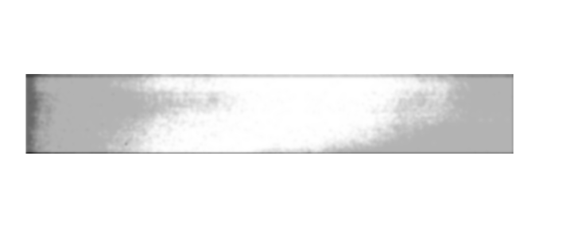

 <h1>Orvosi képdiagnosztika 1. Házi Feladat</h1> 

 <h3>képalkotás modellezése
lineáris rendszerekkel</h3> 

[Feladatkiírás](https://home.mit.bme.hu/~hadhazi/Oktatas/OKD22/HF1/hf_modell.pdf).

A feladatot matlab-bal készítettem el. A main.m-et kell futtatni. A három részfeladatért három függvény felelős.

Az ideális kép:

## Torzított projekció

A torzított projekció megkapásához szükség van az ideális képre (I) és az átviteli függvényre (OTF). Az eredmény kiszámolásához szükség van az eredeti kép spektrumára, ezt egy Fourier transzformációval megkapjuk. A spektrumot szorozni kell az átvieli függvénnyel, így megkapjuk az eredmény spektrumát. A spektrum inverz Fourier transzformáltja pedig a kérdéses kép lesz. Arra kellett figyelni, hogy a kép és az átmeneti függvény mérete nem egyezett. Ezért a képet felnagyíottam a megfelelő méretre.

$$ Projection = F^{-1}(F(I) * OTF)$$

## Zaj

A zaj kiszámolásához szükségem volt a modulációs átviteli függvényre (MTF), ezt az OTF abszolute értékeként kaptam meg. 

$$ MTF = |OTF| $$

Kiszámoltam a detektor fizikai területét, ehhez szükség volt a kép sorainak és oszlopainak számára (Nx, Ny), valamint az érzékelők fizikai méretére (dx, dy). Ezekből:

$$ Area = (Nx*dx) * (Ny*dy) $$

A megadott és eddig kiszámolt adatok segítségével ki tudtam számolni a Noise Equivalent Quanta (NEQ) értékét. Szükség van a megadott Detective Quantum Efficiency (DQU) értékére és a detektort érő fotonok számára. Az utóbbit megkapjuk az egy érzékelő elemre jutó fotonok számának (Q) és az érzékelő méretének hányadosaként (dx*dy), $Q/detector = {{Q} \over {dx * dy}}$  NEQ értéke az alábbi módon kapható meg:

$$ DQE = {{NEQ} \over {Q/detector}} $$

$$ NEQ = DQE * Q/detector $$

Ezek után a normalizált Noise Power Spectrum (NNPS) értéke megkapható az alábbi képletből:

$$ NEQ = {{MTF^2} \over {NNPS}} = SNR^2 $$

$$ NNPS = {{MTF^2} \over {NEQ}} $$

NNPS értékéből meghatározható a Noise Power Spectrum (NPS). Ehhez szükség van arra az értékre, ami azt mondja meg, mi a detektor válasza, olyan helyen ahova Q foton érkezik (A). Ezt megkphatjuk:

$$ A = {Q \over Area} $$

ebből megkapjuk NPS értékét:

$$ NNPS = {NPS \over A^2} $$

$$ NPS = A^2 * NNPS $$

Ezekből már meg tudjuk határozni a zaj spektrumát. Ehhez szükség van egy eloszlásra és a várható értékre. A várható érték az NPS lesz. A várható érték és normál eloszlás szorzata megadja a zaj spektrumát. A zaj spektrumából egy inverz Fourier transzformációval megkapjuk a zajt.

## CNR

Megállapításához ki kell választani három területet a képből. Ezek a területek az A, B és N. A és B azok, amik között vizsgálni fogjuk a kontrasztot, N pedig olyan ahol nincs semmi a sugarak útjában. A-nak egy csontos részt választottam a koponyából, B-nek pedig egy világosabbat a toroknál.

| A | B | N |
| :---: | :---: | :---: |
|  |  | |

Ezek megállapítása után be kell helyettesíteni a képletbe:

$$ CNR_{A,B} = {{|\mu(A) - \mu(B)|} \over {std(N)}}  $$

ahol std a szórás, $\mu$ pedig a várható érték. A várható értékként a választott részek középértékével számoltam. Ezen kívül még fontos, hogy a képek szürkeárnyalatosak.