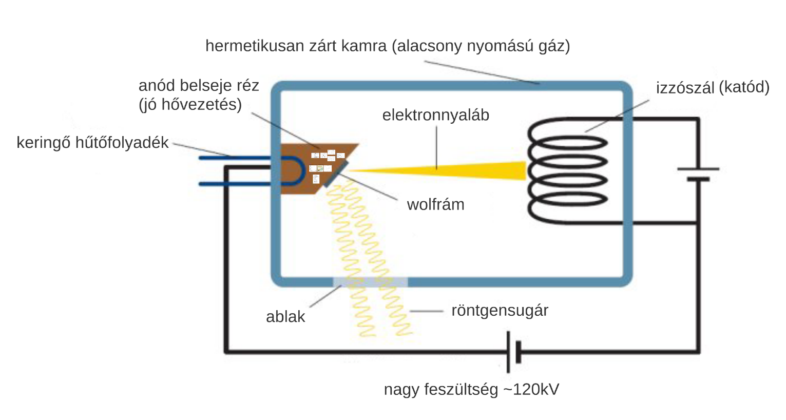
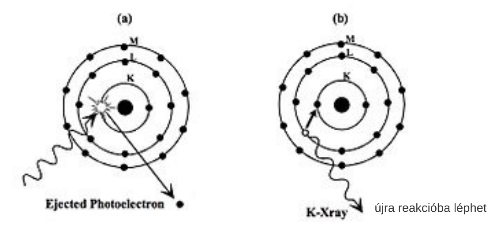
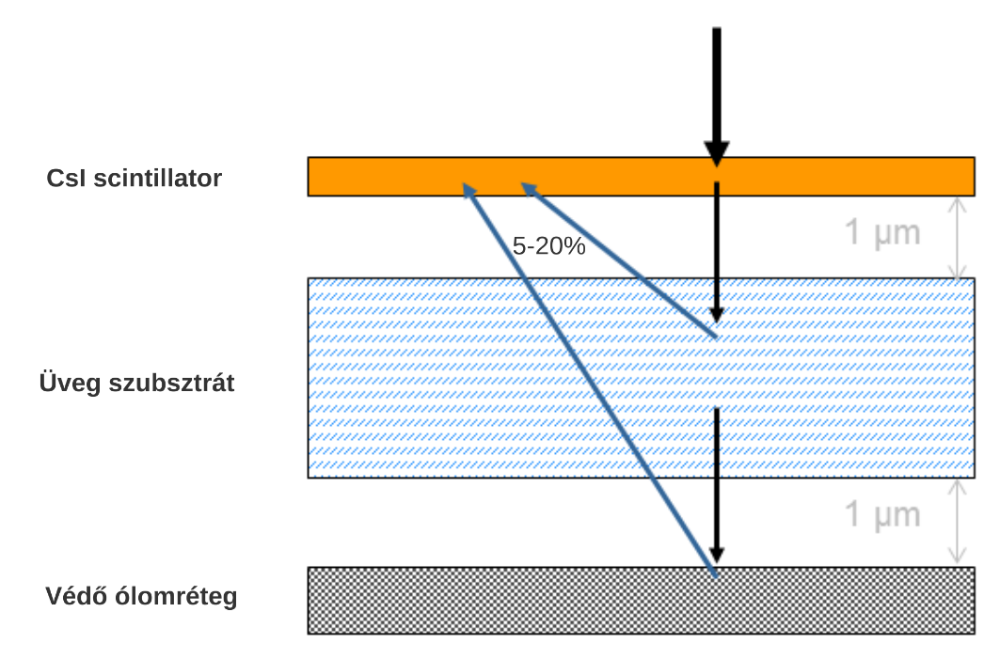
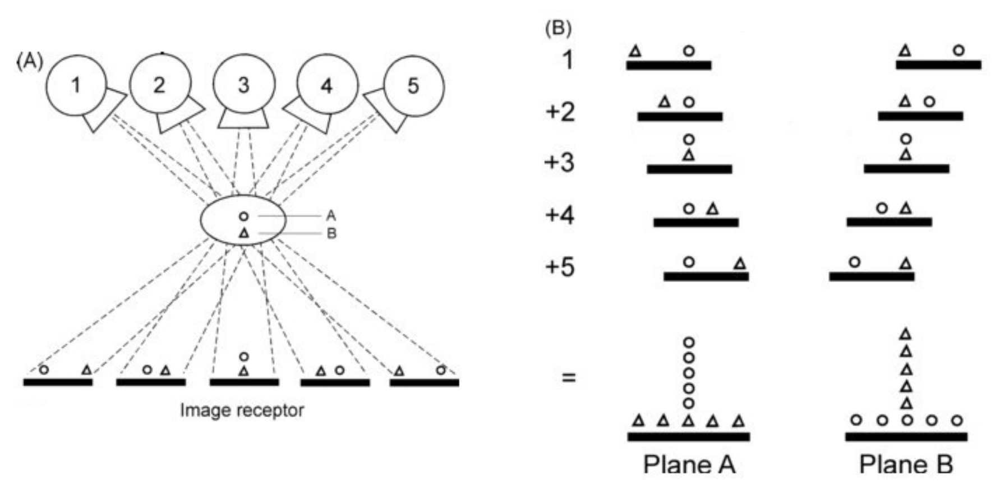

# Röntgen

[Prezi](https://prezi.com/xp0e6krsgvyh/orvosi-kepdiagnosztika-eloadas-x-ray/)

## Röntgen gép felépítése

### Röntgencső

Hő hatására elektronok lépnek ki a katódból. Kölcsönhatásba lépnek az anóddal, aminek hatására röntgensugár keletkezik.

### Kollimátor

Feladata a sugárnyaláb szélességének korlátozása

**Inverz négyzetes törvény**. Minél messzebb vagyunk a sugárnyaláb kiindulási ponjától, annák kevesebb sugár halad át egységnyi területen. A csökkenés a távolsággal négyzetesen arányos. Nem lesz egyenletes a detektorra vetülő sugár intenzitása, középen intenzívebb.

$$ Intensity = \propto {{1} \over {distance^2}} $$

### Detektor

## Fotoelektromos kölcsönhatás

- foton kiüt egy belső elektront
- helyére lépő kintebbi elektron, enegiát ad le foton formájában

## Compton szóródás

- foton kiüt egy külső elektront
- minél nagyobb a szóródás szöge, annál több energiát veszít a foton

## Csillapodás

A csillapodás miatt lesz röntgenképünk. A csillapodás exponenciális.

### Monokróm sugár
Feltételezzük, hogy a spektrum egy vonalból áll (nehezen megoldható).

**Beer-Lambert törvény**

$$ I = I_0e^{- \mu x} $$
- I: kilépő intenzitás
- $I_0$: belépő intenzitás
- $\mu$: lineáris csillapítási együttható
  - mennyire nehezen áthatolható egy anyag
  - arányos a sűrűséggel
  - minden fotonenergiára/röntgenspektrumra más
- x: réteg vastagsága

### Polikróm sugár
Folytonos spektrum (gyakorlatban).

**Módosított Beer-Lambert törvény**

$$ I = \int_{E_{min}}^{E_{max}} I_0(E)e^{- x \mu(E)}dE $$
- I: kilépő intenzitás
- $I_0$: belépő intenzitás, energiafüggő
- $\mu$: lineáris csillapítási együttható, energiafüggő
- x: réteg vastagsága

## Antiscatter grid

Csökkenti a szórt sugárzást, így élesíti a képet, javítja a kontrasztot.

## Detektor

Érzékeli a berérkező röntgen sugarakat.

### Szcintillátor
A röntgen sugarakat látható fénnyé alakítja. [Lásd](2.md/#szcintilláció-1).

### Pixelek

Háromn fotodiódával lehet meghatározni egy pixelt.

### Quantum Detector Efficiency

Mennyire jól hasznosítja a detetktor, a sugarakat.

$$ QDE = {SNR_{ki}^2} \over {SNR_{be}^2} $$

### Sötétáram korrekció

Akkor is folyik áram a diódában, ha nem érzékel fényt.

### Erősítés korrekció

### Backscatter

Visszaverődnek a fotonok és rossz helyen detektálódnak.

### Modulation Transfer Function

Detektor frekvenciabeli jellemzője.

## Digitális Tomoszintézis

Több szögből és pozícióból készítünk felvételt, majd ezeket együtt értékeljük.

## Fluoroszkópia

Röntgen videó.

## Duál energiás felvétel

Két különböző effektív energiájú röntgen sugárral készítenek felvételt.

## Komputertomográfia

### Multi Slice CT ("simán" CT)

A sugárforrás spirálisan mozog a test körül.

### Cone beam CT

Nagyjából 200 fokos körbefordulás. Jelentős a szórt sugárzás, ezért a Hounsfield egységek nem túl pontosak.

### Electron Beam Tomography

Nincsen forgó alkatrész, az anód helyezkedik el körkörösen, elektron nyaláb jár körbe. Gyors, de drága.

### Pitch

$$ pitch = {{table Traver Per Rotation} \over {nominalSliceWidth}} $$

### Low-dose CT
Alacsonyabb sugárintenzitás. Szélesebb sugár és gyorsabb haladás jellemzi.

### HRCT

Low-dose CT ellentéte.

## 3D Rekonstrukció

Annak meghatározása, hogy a páciens testét reprezentáló voxelek (volume pixel, "3D pixel") milyen $\mu$ csillapítási együtthatóval rendelkeznek.

### Linearizálás

Beer-Lambert törtvény:
$$ I_x = I_0e^{- \mu x} $$
- $I_x$: intenzitás x vastagság után

Linearizálás:

$$ \mu x = ln{{I_0} \over {Ix}} $$
- $\mu x$: ezt vetítjük vissza
- $I_0$: ezt mérjük a detektoron, amikor nincs semmi az útban
- $I_x$: ezt mérjük a detektoron felvétel készítése közben

### Hounsfield egység (HU)
Ilyen intenzitás tartományra kell leképezni a rekonstruált képet, hogy szabványos legyen.

$$ HU = 1000 * {{\mu - \mu_{water}} \over {\mu_{water} - \mu_{air}}} $$

## Artifaktok

### Sugárkeményedés

A belsőbb részeken kevésbő csillapodik a sugárm nert már keményebb lett, ezért úgy tűnik mintha belül kisebb lenne a csillapítási együttható.

### Szóródás

Nem lesznek alacsony intenzitások a vetületekben.

### Foton éhezés

Fém implantátumok szinte teljesen blokkolják a sugarat.

  

# Ellenőrző kérdések

## Vázlatosan ismertesse egy röntgen alapú képalkotó berendezés felépítését! Hogyan keletkezik a röntgen foton, mi határozza meg az energiáját? Mit nevezünk kollimátornak? Mit mond ki az inverz négyzetes törvény? Vázlatosan ismertesse, hogy miből áll egy röntgen detektor?

xxx

Inverz négyzetes törvény: Minél messzebb vagyunk a sugár kiindulási pontjától, annál kevesebb sugár halad át egységnyi területen

## Értelmezze a lentebbi összefüggést! Saját szavaival adj meg, hogy mit modellez? Monokromatikus röntgensugár esetén hogyan egyszerűsödik az összefüggés? Hogy nevezzük azt az artifaktot, mely abból ered, hogy hibásan monokromatikusnak feltételezzük a röntgensugarat?

$$ \int {\int {I_0(E) * exp(- \mu(x(s), E))}ds}dE $$

A sugár kilépő intenzitása függ  a belépő intenzitástól (energiafüggő), az anyag vastagságától és a csillapítási együtthatótól (energiafüggő). 

???

##  Mi történik foto-elektromos kölcsönhatás, illetve Compton szóródás esetén? Milyen fizikai anyagok milyen jellegű interakcióit írják le ezek a jelenségek? Értelmezze a lentebb megadott összefüggést! Ez az előbb felsorolt két hatás közül melyiket írja le? Leginkább mely változótól függ ezen kölcsönhatás bekövetkezésének a valószínűsége? Mely energiatartományokban domináns a fentebb megnevezett két kölcsönhatás?

$$ E_f = E_{he} + E_{eke} $$

A fotoelektromos jelenség során egy foton ütközik egy belső elektron hélyon levő elektronnal és kiüti azt, a helyére lépő kintebbi elektron energiát ad le foton formájában. Compton szóródáskor az ütközés külső hélyon történik és minél nagyobb a szoródás szöge, annál több elektront veszít a foton.

Foton és elektron rugalmatlan ütközését.

A foton energiája megegyezik a kilökött elektron mozgási és töltési energiájával.

Annál gyakoribb minél nagyobb rendszámú az elem és minél lassabb a foton.

???

## Mi a szcintilláció lényege? Milyen esetekben van rá szükség? Nevezzen meg egy konkrét ilyen esetet! Mi a sötétáram, valamint az erősítéskorrekció lényege? Mit nevezünk bakscatternek?

A röntgen sugarakat látható fénnyé alakítja. Ha a detektor nem képes a magas energiájú röntegn sugarakat érzékelni. Röntgen vizsgálatkor. 

A sötétárom amikor fény érzékelés nélkül is folyik áram a diódában.

Backscatter, amikor a visszaverődő fotonok rossz helyen detektálódnak.
