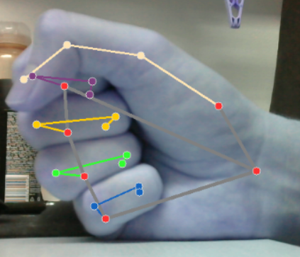
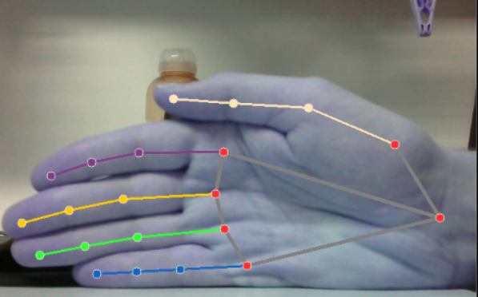
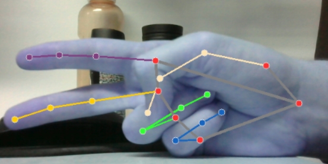
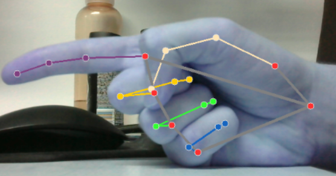

# Kő, Papír, Ollo 
_Dokumentáció_

Rittgasszer Ákos, Z8WK8D

## Feladat

A feladat, az utolsó laborból kiindulva egy kő, papír, olló játék megvalósítása. 

A játék elvárt működése, hogy a felhasználó jelzi a kamerának, hogy elkészült. Ezt a mutató ujj kinyújtásával lehet megtenni. Ezt követően a játékos mutat egy választott tárgyat.

A játék véletlenszerűen sorsol egy másik tárgyat. Végül kiírja, hogy az eredményt. Vagyis, hogy nyert vagy vesztett a játékos illetve, hogy esetleg döntetlen volt az eredmény.

## Megvalósítás

A megvalósításhoz első lépésként szükség volt egy olyan függvényre, ami megmondja, hogy aktuálisan mit mutat a játékos. Ez lehet, kő, papír, olló, elkészült vagy semmi.

A kő felismeréséhez azt kell vizsgálni, hogy mindegyik ujj be van-e csukva. 

A hűvelykujj kapcsán felmerült egy probléma. A keretrendszer az ujjak pontjai által bezárt szög alapján dönti el, hogy egy ujj csukott vagy nyitott állapotban van-e. Ez a legtöbb ujjnál jól működik. A hűvejkujjnál azonban ha kényelmesen becsukva tartjuk, akkor nem zárnak be elég nagy szöget a pontok, ahhoz, hogy becsukottnak értelmezze. Ennek kiküszöböléséhez ennek az egy újnak csökkentettem a szögét, hogy mikor tekinti zártnak. A probléma szemléletesebben az alábbi képen látható:

A papír felismeréséhez arra van szzükség, hogy mind az öt ujj nyújtott állapotban legyen.

Ollót akkor detektálunk, ha a mutató és középső ujj van kinyújtva, de a többi be van csukva.

Az elkészült állapot jelzése úgy lehetséges, ha csak a mutató ujj van kinyújtva, a többi csukott állapotban van.

Minden más esetben nem értelmezzük értlemes jelként amit a játékos mutat.

Amennyiben a játékos a megfelelő módon jelzi, hogy elkészült, a játék arra vár, hogy a kő, papír és olló közül valamilyen értelmes jelet mutasson. Ha ennek kiválasztása és mutatása megtörtént a játék sorsol egy jelet véletlenszerűen és azzal összehasonlítva dönti el a végeredményt.