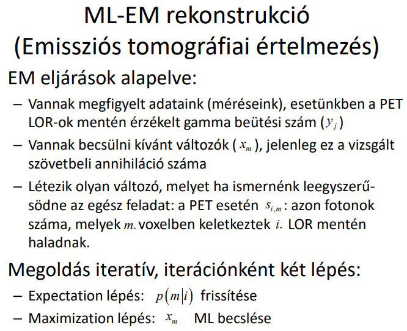

## T12

Ismertesse a Pozitron emissziós tomográfia alapú képalkotás működési elvét! Ismertesse az MLEM eljárást PET modalitás rekonstrukciós problémáján alkalmazva, értelmezze annak módosító összefüggését! Mi a tömörített érzékelés alapötlete? Hogyan alkalmazható ez rekonstrukciók esetén? Mit értünk kvantitatív képalkotás alatt? CT esetén a csillapítási együtthatókat milyen „mértékegységben” állítjuk vissza? Mit értünk sugárkeményedés, részleges térfogat, foton éhezés, fém, illetve szóródásból eredő artifakt alatt? Ezeket hogyan lehet kompenzálni, azok hogyan degradálják a rekonstruált kép minőségét?

---

Pozitron emissziós tomográfia: 

ML-EM PET-en alkalmazvaz: 

Részleges térfogat artifakt: Széles kollimálású nyalábnál csak a szelet projekciók egy részére vetül az objektum

Foton éhezés artifakt: Vizsgált térfogaton belüli anyagok teljesen elnyelik a röntgen fotonokat (tipikusan fémek, sűrű csontok)

Fém artifakt: fémek teljesen elnyelhetik a sugarat / keményen csillapíthatják / részleges térfogat /…