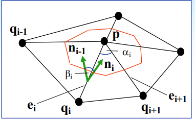

# Vizsga

## Görbék és felületek

### Hogyan lehet pontokat kombinálni, mit jelent az affin invariancia, miért fontos ez (1b:3-7,27,28) S+K
Lineáris kombináció: $r = \sum_{i=1}^{n}\alpha_i p_i$

Baricentrikus kombináció: ha$\sum^n_{i=1}\alpha_i = 1$

Konvex komnbináció: ha minden $\alpha_1$ nem negatív

### U: Hogyan lehet ponthalmazokat kombinálni (súlyozni); lásd U(pontok kombinálása)

### U: Szemléltesse az affin invarianciát egy egyszerű Bézier görbe esetén; lásd U (affin invariancia)

### Hasonlítsa össze az implicit és parametrikus felületreprezentációkat, előnyök-hátrányok (1b:10) S+K

Implicit esetben egy ponthoz rendelünk egy számot. Ha a szám 0, akkor a pont az alakzaton van, ha negatív akkor az alakzaton belül, ha pozitív akkor kívül. Szabályos alakzatoknál szokás használni.

Parametrikus esetben egy (3D esetben 2 számhoz) számhoz (0 és 1 közötti) rendelünk egy pontot. Szabad felületeknél használjuk.

### Implicit görbék egyenlete és értelmezése (1b:13,14) S+K

Egy ponthoz rendelünk egy számot. Ha a szám 0, akkor a pont az alakzaton van, ha negatív akkor az alakzaton belül, ha pozitív akkor kívül. Gradiens vektort parciális deriválással kapjuk.

### U: értékeljen ki egy implicit görbét; milyen félterekbe esnek az adott pontok; határozza meg a gradienst és az érintő egyenest egy kiválasztott pontban; lásd U(Implicit görbék) vagy (1b:15,16)

### U: határozza meg az adott felület gradiensét és értékelje ki egy adott pontban, majd ez alapján írja fel az érintősík egyenletét; lásd U(Implicit felületek)

### Parametrikus görbék egyenlete; deriváltak, tangens, simuló sík és simuló kör származtatása; a görbület bevezetésének szükségessége; a torzió és a kisérő triéder definiciója 3D-s görbéknél (1b:17,20,25,26) S+R+K

Első derivált az érintő vektor. Az ívhossz (s) szerinti első derivált 1 hosszú és merőleges a második deriváltra. Az első ívhossz szerinti derivált az érintő egységvektor. 

$\kappa(t) = \frac{1}{\rho(t)} = \frac{|\dot r(t) \times \ddot{r}(t)|}{|\dot r (t)|^3}$

### U: határozza meg egy parametrikus görbe érintő egyenesének egyenletét; lásd U(érintő egyenes) vagy (1b:21,22)

### Mit jelent az átparaméterezés, mi az ívhossz szerinti paraméterezés (1b:18,20), ismertesse milyen határérték alapján határozzuk meg egy parametrikus görbe ívhosszát; hogyan adódik az integrálformula (1b:19) S+K

Az átparaméterező $u(t)$ függvény folytonos, szigorúan monoton és differenciálható. t értelmezési tartománya változik. Ívhossz szerinti paraméterezésnél a 0-1 intervallumot a 0-L intervallumra képezzük, ahol L a görbe hossza. Az ívhossz megkapható: $s(t) = \int_a^t|\dot r(\tau)|d\tau$

### U: paraméterezze át az adott parametrikus görbét; U(átparaméterezés)

### Implicit felületek egyenlete és értelmezése (1b:30) S+K

Egy ponthoz rendel hozzá számot, az implicit görbékhez hasonlóan.

### Parametrikus felületek egyenlete; deriváltak, normálvektor, konstans paraméter vonalak (1b:31),ismertesse milyen határérték alapján határozzuk meg egy parametrikus felület területét; hogyan adódik az integrálformula (1b:34) S+K

Két számhoz (paraméterek) rendel hozzá egy pontot. Konstans paraméter vonalak azok, amikor az egyik paraméter értékét rögzítjük. A normálvektor: $n = \frac{r_u \times r_v}{||r_u \times r_v||}$, ahol $r_u$ és $r_v$ az u, illetve v szerinti deriváltak. A felület: $A = \int\int|r_u \times r_v|dudv = \int \int \sqrt{EG-F^2}dudv$, ahol $E = r_u^2$, $F = <r_u, r_v>$ és $G = r_v^2$.
 
### U: írja fel az adott konstans paramétervonal egyenletét, határozzon meg deriváltakat és felületi pontokat; U(parametrikus felületek) vagy (1b:32,33)

### Parametrikus felületek görbülete, főgörbületek, az Euler egyenlet jelentése, Gauss és átlag görbület definiciója, pontok jellemzése, umbilikus pontok (1b:31,35,37,40), S+R+K

Főgörbületek a minimális és maximális görbület, amik merőlegesek egymásra. Euler egyenlet: $\kappa(\phi) = \kappa_1\cos^2\phi+\kappa_2\sin^2\phi$.

Gauss szorzat: $G = \frac{LN-M^2}{EF - F^2}$, ahol $L = r_{uu}n$, $M = r_{uv}n$, $N = r_{vv}n$. Az átlaggörbület $ \frac{NE - 2MF + LG}{2(EG - F^2)}$.

Ha $G > 0$ akkor a felület eliptikus, ha $G < 0$ akkor a felület hiberbolikus és ha $G = 0, M \ne 0$ akkor a felület parabolikus.

### Weingarten-leképzés és a mátrixának tulajdonságai, felírása különböző bázisokban (1b:41,42), implicit felületek Weingarten-mátrixa (1b:44) [beágyazott nem kell], S+K

A leképezés megkaphtó $I^{-1}II$, ahol $I =  \begin{matrix}E& F \\ F&   G\end{matrix}$ és $II = \begin{matrix}L& M \\ M& N\end{matrix}$

Implicit esetben a mátrxi: $\begin{matrix}f_{xx}& f_{xy}& f_{xz} \\ f_{xy}& f_{yy}& f_{yz} \\ f_{xz}& f_{yz}& f_{zz}\end{matrix}$

## Háromszöghálók 

### Mi a tesszelláció, mire jó, milyen elvárásaink lehetnek (2a:3-5); ismertesse milyen mérőszámokkal lehet háromszöghálókat jellemezni (2a:7); adja meg a Delaunay kritériumot és a háromszögelés kedvező jellemzőit; ismertesse a Voronoi tesszelláció tulajdonságait; magyarázza el a duális struktúrát (2a:8-9); milyen kritérium alapján működik az élcsere algoritmus (2a:10) S+K+R

A tesszelláció az a folyamat ami során a rendelkezésünkre álló adathalmazra illesztünk egy megfelelő lineáris struktúrát. Például egy ponthalmazból készítünk szép háromszög hálót. 

Mérőszám egy háromszög háló jellemzésére lehet, a legkisebb szög, a körülírt kör és a belső érintőkör sugarának aránya, a leghosszabb oldal és a magasság aránya és a legrövidebb oldal és a körülírható kör sugarának aránya

Delaunay kritérium azt jelenti, hogy olyan háromszögeket kapunk, amiknél a körülírható körökben nincsen másik háromszög pontja. Kedvező jellemzői, hogy egyenletes a háromszögeloszlás, maximalizálja a legkisebb szöget, minimalizálja a legnagyobb körülírható kör sugarát és minimalizálja a beírható körök sugarainak összegét.

Voronoi diagrammnál a sík minden pontja, a hozzá legközelebb levő kontrol ponthoz tartozik. Ha egy Delaunay háromszögelés háromszögeinek köréírható köreinek középpontjait összekötjük (csak a szomszédosokkal), akkor Voronoi diagramot kapunk.

Élcsere algoritmus esetén a konvex négyszögeket vizsgáljuk. Ha nem teljesülnek a feltételek akkor megcseréljük az éleket. A vizsgálatnál a szemközti szögek összegét vizsgáljuk és ezeknél mindig a nagyobb szögpár csúcsait kell összekötni.

### U: rajzolja meg az adott ponthalmazhoz tartozó Voronoi diagrammot és Delaunay-triangulációt; lásd U(Delaunay...) vagy (2a:11,12)

### Magyarázza el a söprővonal algoritmus (Fortune) lényegét; mutassa be a csúcs-eseményt (új Dcsúcs) és a kör-eseményt (új V-csúcs) (2a:14,15) S+R

Balról jobbra mozog egy söprő egyenes. Az egyenestől balra egy kész voronoi diagram van. Két esemény lehet, az új csúcs és az új kör.

Csúcs eseménynél a vonal elér egy pontot ami még nem tartozik a diagramhoz. Ekkor ezt befűzi a diagramba parabolaként.

Új kör eseménynél a vonal elér egy körívet. Ekkor megszűnik egy parabola és létrejön egy végleges csúcs.

### Miért nehéz implicit felületeket háromszögelni; ismertesse a sétáló négyzet/kocka algoritmus lényegét (2a:23,26); írja le miért könnyű vágott (trimmelt) parametrikus felületeket háromszögelni (2a:22) S+R

Mozgatunk egy négyzetet és keressük azt a helyet ahol a csúcsaihoz tartozó értékek nem azonos előjelűek. Ez alapján meg lehet becsülni, hol megy az alakzat.

???

### U: értékeljen ki egy implicit görbét a sétáló négyzet módszer segítségével; lásd U(sétáló négyzet) vagy (2a:24,25)

### Mi a decimálás, hogyan működik a négyzetes hiba alapú klaszterező eljárás? (2b:3-8) S+K

A decimálás a háromszögháló egyszerűsítése. Klaszterekre bontjuk, amikben megfelelően kevés pont található. Ha egy cella elég kicsi és elég sok pont van benne, akkor hozzáadunk új pontot.

 ????

### Milyen módszereket ismer normálvektor becslésére? (2b:20, 3c:5-6) S+R+K

Normálvektpr becsléséhez használhatjuk a környező háromszögek normálvektorait: $n_p = \frac1n \sum_in_{i0}$. Ennél pontosabb becslést kapunk, ha a környező normálvektorokat a háromszögek területeivel súlyozzuk. Tovább pontosítva: $n = \sum_{i=1}^{n} n_i \cdot \frac{A_i}{||v_i||^2||v_{i+1}||^2}$

### Hogyan lehet végtelenül kis sugarú hengerek és gömbök bevezetésével háromszöghálón átlag és Gauss-görbületet definiálni? (2b:21) S+R+K

A Gauss görbület: $G(p) = \frac{\delta(p)}{\frac13A(p)}$, ahol a $\delta(p) = 2\pi - \sum_i \alpha_i$ vagyis a szöghiány. 

Az átlaggörbület: $H(p) = \frac{\frac14\sum_i\beta_i|e_i|}{\frac13A(p)}$, ahol $\beta_i$ az $i.$ és $i-1.$ háromszög által bezárt szög, $e_i$ pedig a közös élük.

### Milyen módszereket ismer poligonhálók tárolására, és mi ezeknek az előnye ill. hátránya? (3b:5-8) S+R

Háromszögek tárolása: Egyszerű, de egy csúcs többször is szerepel valamint nincs topológia. (.stl)

A elöbbi továbbfejlesztett változata, amikor eltárolunk minden pontot egyszer és aztán ezekre indexel hivatkozunk, ez az pontismétlést oldja meg. (.ply)

Fél-él adatstruktúra: Irányított élpárokat tárolunk. Vannak topológikus információk

## Görbék és felületek

### Mi a Lagrange interpoláció lényege, milyen tulajdonságokkal rendelkeznek a súlyfüggvények; mi a Hermite interpoláció lényege, milyen tulajdonságokkal rendelkeznek a súlyfüggvények (5:3,4) S+K

Lagrange: Adott n+1 pont és paraméter. A cél, hogy $r(t_k) = p_k$. A súlyfüggvények: $L_k(t)$ 0, ha $j=k$ és 1 ha $j\neq k$. $r(t) = \sum_{k = 0}^np_kL_k(t)$

Hermite: Adott $p_A$, $t_A$, $p_B$, $t_B$, $t \in [0,1]$. Cél $r(0) = p_A$, $r(1) = p_B$, $r'(0) = t_A$, $r'(1) = t_B$. Súlyfüggvények: $r(t) = p_AF_0(t) + t_AG_0(t) + p_BF_1(t) + t_BG_1(t)$.

### U: bizonyítsa be, hogy az adott súlyfüggvények megvalósítják a Hermite interpolációt; U(Hermite...) vagy (5:5,6)

### Hogyan definiáljuk a Bernstein polinomokat, írja fel pl. a B5 2(t) súlyfüggvényt és segítségével ismertesse a Bernstein polinomok legfontosabb tulajdonságait (5:7-8) S+K

n-ed fokú Bernstein polinom: $B_k^n(t) = {n \choose k}(1-t)^{n-k}t^k$. A pascal háromszög.

### Írja fel a Bézier görbe egyenletét és ismertesse a legfontosabb tulajdonságait (5:9,10) S+K

$r(t) = \sum_{k=0}^n c_kB_k^n(t)$

### U: hajtsa végre a de Casteljau algoritmust az adott kontrollpoligon alapján; U(de Casteljau) vagy (5:12,13)

### U: hajtson végre egy fokszámemelést az adott kontrollpoligon alapján; U(fokszámemelés) vagy (5:12,13)

### Hogyan lehet meghatározni a Bézier görbék deriváltjait (5:15); két szegmens összeillesztésénél mit jelent a parametrikus illetve a geometriai folytonosság (görbületképlet nem kell) (5:15-16) S+K+R

$\dot r(t) = n\sum_{j=0}^{n-1}(c_{j+1} - c_j)B_j^{n-1}(t)$

Parametrikus folytonosság, hogy a két görbe illeszkedésénél a deriváltjuk azonos.

Geometriai folytonosság, hogy az illeszkedésnél az érintők azomosak.

### Írja fel a Bézier felületek egyenletét (5:17), hogyan lehet kiszámolni a deriváltakat a határok mentén (5:18); mi a bilineáris interpoláció, szemléltesse a de Casteljau algoritmust felületekre (5:19) S+K+R

$s(u,v) = \sum_{i=0}^n\sum_{j=0}^mc_{ij}B_i^n(u)B_j^m{v}$

### Hasonlítsa össze a Bézier és B-spline reprezentációkat; mi indokolta a B-spline-ok bevezetését (6:3,17) S+K+R

### Írja fel a B-spline görbe egyenletét, és ismertesse a legfontosabb tulajdonságait (6:3,7) S+K+R

$r(u) = \sum_{i=0}^{L-1}P_iN_i^n(u)$

### Foglalja össze a harmadfokú B-spline bázisfüggvények tulajdonságait; milyen folytonosság teljesül a B-spline szegmensei között; mit jelent a végponti interpoláció; hogyan keletkeznek zárt B-spline-ok (6:3-7) (a rekurzív formula nem kell) S+K+R

A bázisfüggvény rekurzív formulával adható meg. Az összegük 1 és egyenként nem negatívak.

$C^{n-1} $ folytonosság teljesül

### Mire szolgál a poláris forma, ismertesse a négy alaptulajdonságot (6:8) S+K+R

Tulajdonságok: Görbepont, permutáció invariáns, egyenletes két ponton át, affin kombináció.

### U: határozza meg egy adott B-spline görbe poláris koordinátáit (cimkéit) és a szegmens végpontjait; lásd U(poláris koordináták) vagy (6:9,10)

### U: szúrjon be egy új csomót az adott csomóvektorba és határozza meg az új kontrollpont poláris koordinátáit; lásd U(csomó beszúrás) vagy (6:12,13)

### U: B-spline görbe kiértékelése többszörös csomóbeszúrással; a de Boor algoritmus szemléltetése, lásd U(de Boor) vagy (6:14)

### U: Bézier szegmensek előállítása B-spline-ból polár koordináták segítségével; lásd U(Bézier szegmensek) vagy (6:15)

### Írja fel a B-spline felület egyenletét, és ismertesse a legfontosabb tulajdonságait (6:18) S+K

$s(u,v) = \sum_{i=0}^{L_u-1}\sum_{j=0}^{L_v-1}P_{ij}N_i^n(u)N_j^m{v}$

## Interpoláló és rekurzív felosztásos felületek

### Ismertesse az elvi különbséget a kontrollpont alapú tenzorszorzat felületek és az interpoláló felületek között (10:3-5); mi a lineáris Coons felület inputja; milyen komponensekből tevődik össze a Boolean sum egyenlet (10:6, képlet kell); mi a különbség a lineáris és a G1 Coons felületek között (10:8, képlet nem kell); S+R+K

Bezier és B-Spline kiterjesztése nem csak 4 oldalra. A Coon felületek bemenete 4 tetszőleges parametrikus határgörbe. A Boolean sum egyenlet két lineáris tagból és egy korrekciós tagból áll: $S(u, v) = S_1(u, v) + S_2(u,v) - S_{12}(u,v)$, ahol $S_1(u,v) = (1-v)S(u, 0) + vS(u, 1)$, $S_2(u,v) = (1-u)S(0,v) + U S(1,v)$ és $S_{12}(u,v) = \begin{bmatrix}1-u& u\end{bmatrix} \begin{bmatrix}S(0,0)& S(0,1)\\ S(1,0)& S(1,1)\end{bmatrix} \begin{bmatrix}1-v\\ v\end{bmatrix}$

A $G^1$ Coons felületeknél adottak a keresztderiváltak is.

### Irja fel a ribbon alapú, n-oldalú felületek egyenletét; magyarázza el mi a ribbon, mi a domén, milyen célt szolgálnak a súlyfüggvények és mi az (u,v) → (si, hi) leképzés lényege (10:13-17); S+R+K

Egy n oldalú felület ribbon-okból áll. Mindegyik ribbon egy 4 oldalú parametrikus felület. Az egyenlet: $S(u,v) = \sum_{i=0}^{n-1}R_i(s_i(u,v), t_i(u, v))Blend_{oldal}^i(u, v)$. A domén egy n oldalú konvex poligon.   

### U: határozzon meg egy n-oldalú poligonális domént az adott határgörbék alapján U(domén) vagy (10:15)

### Magyarázza el, milyen feltételeket kell kielégítenie a ribbon alapú interpoláló felületek súlyfüggvényeinek (10:17) S+R+K

### U: hozza létre az adott n-patch i-edik súlyfüggvényét és mutassa meg, hogy az elvárt tulajdonságok teljesülnek; lásd U(súlyfüggvény) vagy (10:18,19)

### Ismertesse a rekurzív poliéder felosztáson alapuló felületdefiniciós módszer lényegét (11:4); milyen elvárásaink vannak a kontrollpoliéderrel és a határfelülettel kapcsolatban (11:9,10)

Rekurzív felosztás, a korábbi pontok lineáris kombinációjával. Követelmények: általános topológia, lokális módosíthatóság, egyszerű szbályok, hatékony algoritmuus, affin leképezése invariáns, sima felület, hierarchikus reprezentáció, konvex burok.

### U: mutassa be a három ismert görbe felosztási algoritmust az adott poligonok alapján (saroklevágás (11:4), húrfelezés (11:7), interpoláló felosztás (11:8)); lásd U(rekurzív poligonosztás).

### U: mutassa be az X általános poliédert rekurzívan felosztó algoritmust; X = Doo-Sabin (11:11), Catmull-Clark (11:16), középosztás (11:17); lásd U(rekurzív felosztás1) vagy (11:5,6)

### U: határozza meg a Doo-Sabin súlyokat egy n-oldalú lapra az adott képlet alapján; lásd U(DooSabin) vagy (11:14,15)

### U: mutassa be az X háromszögalapú poliédert rekurzívan felosztó algoritmust; X = Loop (11:18), gyök3 (11:19); lásd U(rekurzív felosztás2)

## Tömör testek modellezése

### A tömör testmodellezés lényege (12:3-6) S

A tömör testek a tér egy jól meghatározott tartománya.

### A konstruktív testmodellezés; előnyök és hátrányok (12:7-8) S+R;

Konstruktív testmodellezésnél egyszerű alakzataink vannak, ezek egy fa levelei a csoópontok pedig rajtuk végrehajtandó transzformációk és halmazműveleteket. Előnye, hogy ez egy egyszerű és tömör reprezentáció, ami tárolja a műveletek sorrendjét. Hátránya, hogy nincs explicit felület információnk, lokálisan nem lehet műveletet végezni és vannak olyan számítások, amik nehezen végezhetőek.

### U: adott 2D-s primitívek alapján építsen fel CSG fákat; lásd U(CSG).

### A határolóelem reprezentáció; előnyök és hátrányok (12:9-11) S+R

Ebben az esetben a testet a határoló alakzatok segítségével adjuk meg. Explicit feület és topológiai információ rendelkezésre áll, lokális műveletvégrehajtás. Hátránya, hogy komplex adatstruktúra, aminek a helyességét biztosítani kell, eredeti tervet nehezen lehet visszaállítani illetve globális műveletek nehezen végrehajthatóak.

### Lokális operációk a tömör testmodellezésben, előnyök és hátrányok, példák (12:13-14). S+R

A test egy lokálisan jól elkülönülő része változik. Például sarok levágása, kihúzás és éles élek helyettesítése.

### Az általános Euler-Poincare egyenlet – képlet is kell (12:15) S+K

$V-E+F-L_i=2(1-G)$, ahol $V$ a csúcsok száma, $E$ az élek száma, $F$ a lapok száma, $L_i$ a belső hurkok száma és $G$ az átmenő lyukak száma.

### U: mutassa meg, hogy az egyenlet teljesül; lásd U (E-P egyenlet) vagy (12:17,18)

### Az Euler operációk definiciója, néhány példa – a „make” és „kill” operációk (12:19) S+R+K

$V-E+F-(L-F) = 2$, a művelet után is teljesüljön az Euler egyenlet. Például új él és pont vagy pont és él törlése.

### U: generáljon egy operáció sorozatot (MEV, MEF, KEML), amely az A állapotból B-be visz; lásd U(Euler operációk) vagy (12:20,21)

## Interpoláció és approximáció B-spline görbékkel ill. felületekkel

### Magyarázza el, hogy miért preferáljuk a B-spline alapú görbeinterpolációt a szakaszonkénti interpolációval szemben; mi az input és milyen mennyiségeket kell meghatároznunk; milyen egyenleteknek kell teljesülnie a belső adatpontokban (képlet kell); a szélső kontrollpontok hogyan vannak meghatározva (9:3,5-7)

Bemenet n adatpont, a kimenet egy B-spine görbe. Előnye a szakaszonkénti interpolációval szemben szebb és folytonosabb eredményt ad. Egyszerübb a leírása. Belső pontok $P_i = C_iN_i^3(u_i) + C_{i+1}N_{i+1}^3(u_i) + C_{i+2}N_{i+2}^3(u_i)$

### Mit jelent az, hogy a B-spline interpolációs feladat alulhatározott, milyen lehetőségek vannak a végpontok megkötésére (9:8)

???

### U: határozza meg az induló tangens nagyságát a parabolikus módszer segítségével (9:8); U(tangens becslés) vagy (9:9,10)

### U: Határozza meg az adatpontokhoz tartozó paraméterértékeket (9:11); U(parametrizáció)

### Ismertesse, hogy rögzített kontrollpont szám és paraméterezés esetén, hogyan kell egy B-spline görbét illeszteni egy adott ponthalmazra; mi az input és az output; hogyan számoljuk a távolságokat; mi a minimalizálandó mennyiség, amelyből kijönnek az egyenletek (16:5) (maga a mátrixegyenlet felírása és az egyenletrendszer képlete nem kell) S+K

A bemenet M darav pont és t érték. Ezekből keresendő az n+1 kontrolpont ami meghatározza a B-spline-t. A távolság, amit minimalizálni kell: $d_i = |P_i - \sum_{j=0}^nc_jN_j(t_i)|$

### Ismertesse a görbe approximációs feladat megoldásának iteratív lépéseit, mikor és hogyan bővítjük a kontrollpontok számát, hogyan értékeljük ki az illesztést és hogyan javítjuk a paraméterezést (16:4,6) S+K+R

Az iteáció lépései:
- kezdeti értékek
- Lsq illesztés (lineáris egyenletrendszer)
- hibakeresés, ha a hiba megfelelően kicsi akkor vége
- újraparametrizálás

### U: hajtson végre egy paraméterkorrekciós lépést az adott parametrikus görbénél; lásd U(paraméterkorrekció) vagy (16:7,8)

### Ismertesse, hogy rögzített kontrollpont szám és paraméterezés esetén, hogyan kell egy B-spline felületet illeszteni egy adott ponthalmazra; mi az input és mi az output; hogyan számoljuk a távolságokat, mi a minimalizálandó mennyiség, amelyből kijönnek az egyenletek (16:9) (maga a mátrixegyenlet felírása és az egyenletrendszer képlete nem kell) S+K

Hasonló mint a görbe esetében csak rácsadatok vannak.

### Hogyan kell paraméterkorrekciót végrehajtani B-spline felületek esetén (16:10); soroljon fel néhány lehetőséget a kezdeti paraméterezés meghatározására (16:11,12) S+K+R

$(U_i, v_i)^{k+1} = (u_i, v_i)^k + (\Delta u_i, \delta v_i)$

## Digitális alakzatrekonstrukció és 3D nyomtatás

### A digitális alakzatrekonstrukció célja, folyamata, és négy legfontosabb alkalmazási területe (13:2, 4-8) S

Van egy alakzatunk de nincs hozzá modell. A cél, hogy el alkossunk egy modelt amivel aztán lehet dolgozni. Hasznos ha mondjuk van egy alkatrészünk amit sokszorosítani akarunk de nincs meg róla modell. Vagy orvosi esetekben, kultúrális megőrzés, minőségellenőrzés.

### Digitális alakzatrekonstrukció - objektumok osztályozása (13:10-11) S

Organikus, természetből származó objektumok.

Művészi alkotások.

Mérnökök által tervezett tárgyak.

### Digitális alakzatrekonstrukció - sorolja fel a folyamat 10 fázisát, néhány mondatban ismertesse mi történik az X-edik fázisban (13:13-27) S

1. 3D-s mérés.......................................... → pontfelhő
2. ponthalmazok egyesítése és ritkítása ... pontfelhő → pontfelhő
3. háromszöghálók létrehozása és javítása............... pontfelhő/háromszögháló → háromszögháló
4. szegmentálás....................................... háromszögháló → tartományok
5. felületek osztályozása.......................... tartományok → attribútumok
6. elsődleges felületek illesztése.............. tartományok → felületek
7. összekötő felületek illesztése............... felületek → felületek
8. modellek tökéletesítése, “fairing”......... felületek → felületek
és kényszerek...................................... felületek → felületcsoportok
9. minőségellenőrzés .............................. felületcsoportok → CAD modell
10. export CAD alkalmazások érdekében ... CAD modell →

### Ismertesse milyen általános szempontok szerint hasonlítjuk össze a 3D-s szkennereket (14:2,3); hasonlítsa össze ezen szempontok alapján az X1 technikát az X2 technikával (14:4-8); (X1,X2= hagyományos koordinátamérőgép (CMM), Lidar, lézer trianguláció, struktúrált fény, photogrammetria, volumetrikus szkennelés) S+R

Fizikai elv: hagyományos koordináta mérő berendezések (CMM), repülési idő (Time of Flight), trianguláció (laser scanning), strukturált fény, photogrammetria, volumetrikus (CT, MRI)

Mérési mechanika és elektronika: három stabil léptetőmotoros szán: XYZ, robot kar, fix kamera + forgóasztal, kézi

egy vagy több koordinátarendszer

pontosság, visszaállás, adatgyűjtési sebesség

(XYZ) vagy (XYZ-RGB)

LIDAR: Light Detection And Ranging: Lézerrel, a fény visszaverődési ideje alapján. drága, épületeknél, 1mm pontosság

Trianguláció: Egy lézer fény pásztázza az alakzatot amit egy kamera dolgoz fel, gyors, 10-50 mikron pontos

Struktúrált fény: Egy mintázatot vetít a testre, amit egy kamera dolgoz fel. Gyors, 10-50 mikron pontos, ipari berendezések használják

Fotogrammetria: Több képből/vidóból más szemszögekből alkot képet. Pontatlan, előnye, hogy a textúrát is rögzíti

Volumetrikus szkennelés: CT, röntgensugarakkal.  MRI mágneses mezővel. Kimenet voxelek. A tárgy belsejét is szkenneli. Gyors, de kevésbé pontos, drága.

### Ismertesse az additív megmunkálás lényegét. Milyen alkalmazási területeket ismer? (21:3-6) S

Egymásra épülő rétegekből rétegenként dolgozik. Orvosi, prototipus készítés, oktatás, hobbi.

### Milyen előnyöket biztosít a 3D nyomtatás a hagyományos eljárásokkal szemben? (21:6-13) S

Olcsóbb, ugyanazzal az eszközzel nem csak egy dolgot lehet készíteni. Relatív nagy felbontás. Különböző anyagok kombinációja.

### Az additív megmunkálás algoritmikus lépései. (21:14-15) S

1. Input: a) CAD modell, b) szkennelt ponthalmaz
2. Háromszögháló létrehozása (.stl)
3. Háromszögháló ellenőrzése és javítása
4. Legjobb orientáció beállítása, külső és belső támasz struktúrák létrehozása
5. 3D nyomtatás
6. Posztprocesszálás

### Milyen problémákat kell kezelni az additív megmunkálás során? (21:6,14,16-21) S+R

Hibás adathalmaz javítása. Támasz struktúrák alkotása. Szeletelés. 

### Ismertesse a 3D nyomtatás három alaptechnológiáját; egy sematikus ábra segítségével magyarázza el az X eljárás lényegét (X= huzalolvasztás vagy sztereolitográfia vagy összesütés (sintering)) (21:22-25) S+R

1. FDM - Fused Deposition Modelling - huzalolvasztás
Anyag: vékony hőre lágyuló műanyag (akril, nejlon, polietilén,
stb.); különböző anyagú/színű vékony huzalok
Támaszanyag: oldható, ultrahangos mosó lúgos folyadékkal

2. SLA - Stereolithography - sztereolitográfia
Anyag: fényre (UV - lézer) szilárduló (fotopolimer) folyadék
Támaszstruktúrára szükség van.

3. SLS - Selective Laser Sintering, DMS - Direct Metal Sintering - szinterezés, összesütés
Anyag: por (granulátum) - (magas) hőmérsékletre szilárduló,
műanyag, acél, réz, kerámia, stb.
Támaszanyag: minimális, a por támasztékot ad
