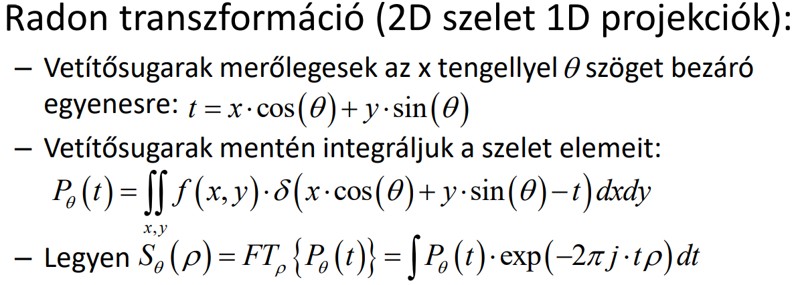
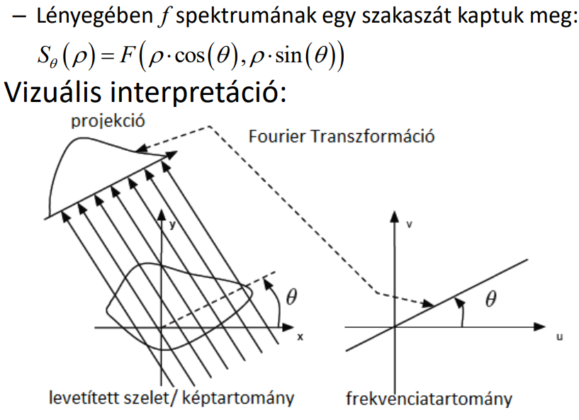
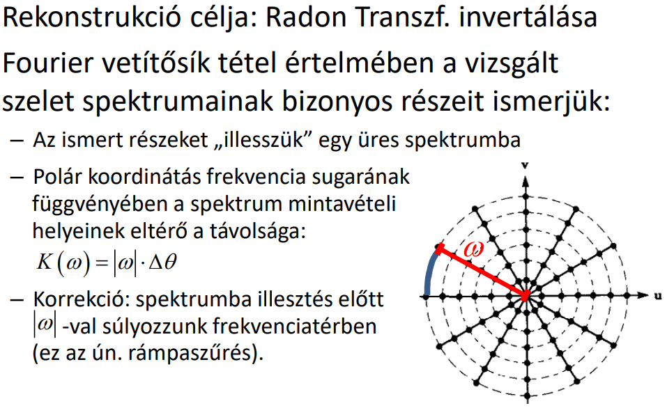
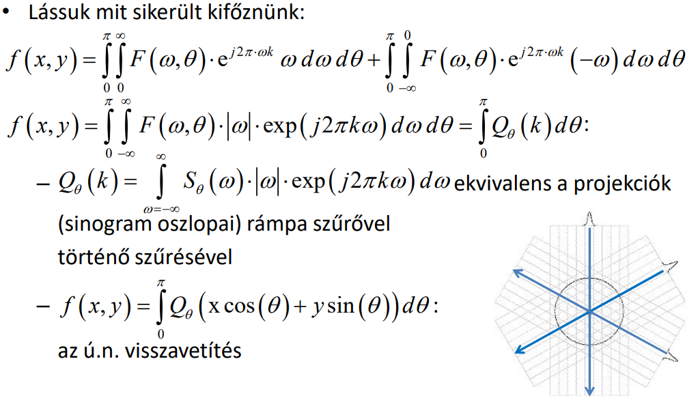

## T10

A Beer-Lambert törvény alapján röntgen rekonstrukciós eljárásoknak mi az első lépése, és miért szükséges ez a lépés? Definiálja formálisan a 2D Radon transzformációt! Mit mond ki a Fourier vetítősík tétel, hogyan alkalmazható rekonstrukciós eljárások esetén? Tömören ismertesse az FBP eljárás működését, és érveljen az eljárás helyessége mellett! FBP esetén hogyan lehetséges zajos projekciók kezelése? Hasonlítsa össze a Paralell-beam, a Fan-beam, és a Cone-beam sugár geometriájú készülékeket! Melyik esetében hogyan alkalmazható az FBP?

---

????

2D Radon transzformáció: Bemenet a 2D koordinátarendszer beli kép, kimenet a sinogram (2D polárkordinátabeli kép). 

Fourier vetítősík tétel: 

FBP:   Zajok kezelésére legegyszerűbb megoldás az aluláteresztés.

|Paralell-beam|Fan-beam|Cone-beam|
|-|-|-|
|Párhuzamosak a sugarak, gyakorlatban nem megoldható|Vetítősugaras helikális, CAT rendszer|kúpszerű sugarak, CBCT|
|hagyományos FBP|mért intenzitások átcsoportosítása párhuzamos vetítősugár alapú geometria  szerint|FDK: klasszikus szűrt visszavetítéssel rekonstruál|
|||ideális esetben sem tökéletes|