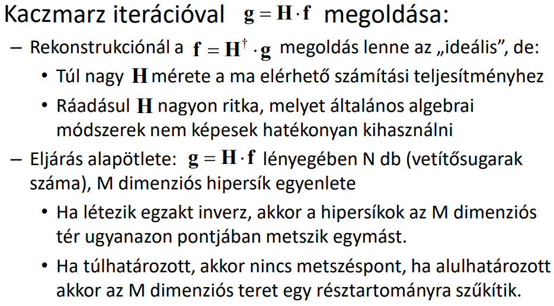

## T11

Mi a Kaczmarz iteráció lényege? Hogyan alkalmazható az eljárás CT, illetve PET modalitás rekonstrukciójára? Értelmezze az SART, valamint az SIRT eljárások módosító összefüggéseit! Mit jelent a projekciók inkonzisztenciája, az additív iteratív eljárások mennyire érzékenyek erre? Mit tud mondani a Gordon ART, az SART, illetve a SIRT zajérzékenységéről?

---

Kaczmarz iteráció:

SART: Egyidejű Algebrai Rekonstrukciós Technika. Hibaképzés nem vetítősugaranként, hanem projekciónként. Jól párhuzamosítható.

SIRT: Simultaneous Iterative Reconstructive Technique. Cimmino iteráción alapul. 

