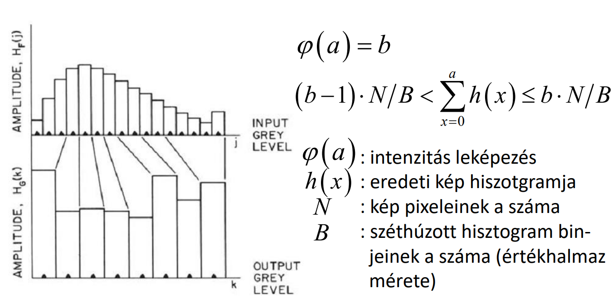

## T6

Mit értünk egy kép hisztogramja, illetve kontrasztja alatt? Adjon egy algoritmust egy kép hisztogramjának kiegyenlítésére! Az eljárás növeli, vagy csökkenti a bemeneti kép kontrasztját? Mikor érdemes adaptív hisztogram módosítást végezni? A zajszűrés milyen módszereit ismeri? Melyiknek mi a jellemzője, mikor alkalmazandóak? Mi a KLT (PCA) transzformáció lényege? Hogyan lehet képek szűrésére alkalmazni? Mi a homomorfikus, illetve mi a rank szűrés milyen esetekben célszerű ezeket használni? Miben térnek el általánosan az adaptív szűrők a konvencionális LTI szűrőktől? Mikor érdemes adaptív szűrőket használni (nevezzen is meg egy konkrét esetet)? Milyen élkiemelő szűréseket ismer? Mi a legfőbb probléma a zónás szűrésekkel?

---

Kép hisztogramja: A kép fényességeloszlását ábrázolja grafikus formában

Kontraszt: Két rész közötti fényességkülönbség

Hisztogram kiegyenlítése: javul a kontraszt

Adaptiv hisztogram kiegyenlítés: Ablakos csúsztatás alapján egyenlít. zajos képnél hasznos. Jobban képfüggő

Zajszűrés:

|Lineáris|Szűrés transzformált tartományban|Nemlineáris|
|-|-|-|
|Képtartományban|bázisfüggvények terében||
|megfelelő mátrixszal szorzás||homomordikus jelfeldolgozás|
|||order statics szűrés|
||||
||||

PCA, KLT: Lineáris szűrés transzformált tartományban. Jelfüggő ortogonális transzformáció. Feltételes szélsőérték keresés.

Homomorfikus szűrés: Multiplikatív zajok mellett hasznos, logaritmálás után hagyományos szűrési eljárások.

Rank szűrés: Order statistics szűrés. Egy ablak által meghatározott pixelhalmazból választja ki az adott rangú pixelt. Ez azt jelenti, hogy a pixelek növekvő intenzitású sorrendjében hanyadik.

Adaptív szűrők: A szűrő a saját paramétereit a bemeneti és kimeneti jel függvényében módosítja. Használható például élkiemelésre, Wallis operátorral

Éldetektáló szűrők: Lineáris szűréssel (Sobel, Prewitt), elmosással, adaptív szűréssel (Wallis operátor), polinomiális szűrő

Zónás szűrés: Lokálisan adnak jó eredményt?