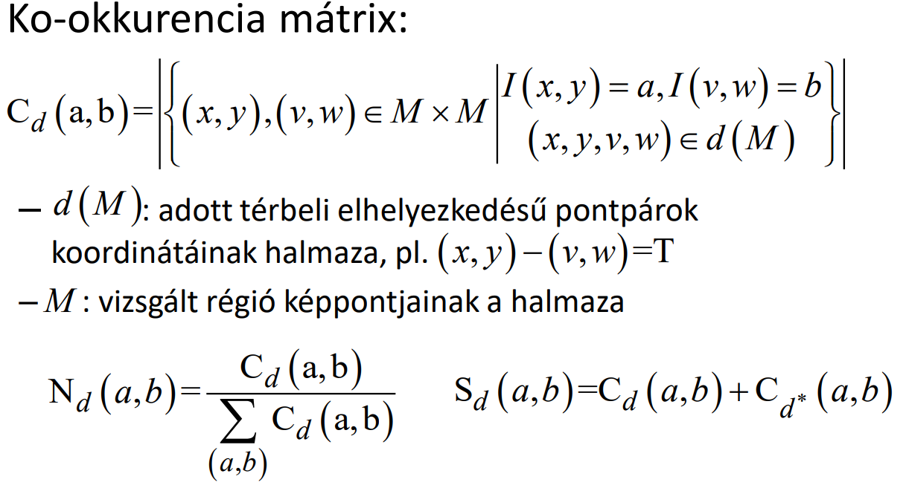
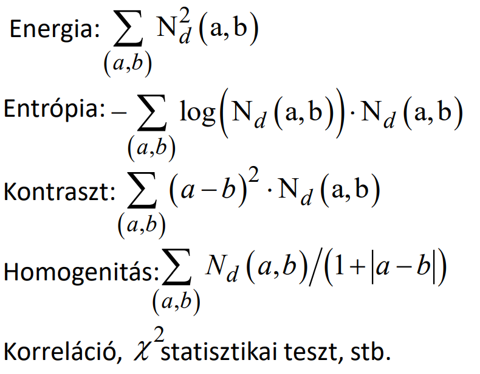

## T7

Mit értünk szegmentálás alatt? Milyen szegmentáló módszereket ismer, hogyan csoportosítaná őket? Mi az EM eljárás lényege és hogyan alkalmazható szegmentálásra? Mi a régió alapú szegmentálás definíciója, milyen eljárásokat ismer a megvalósítására? Mit értünk egy kép textúrája alatt? Mit nevezünk ko-okkurencia mátrixnak? Hogyan definiálná ez alapján egy régió homogenitását, kontrasztját? Mi a Hough transzformáció, milyen problémák esetén alkalmazná?

---

Szegmentálás: Autonóm részek elkülönítése, vizsgálandó terület körülhatárolása, elváltozások körülhatárolása...

|Régió alapú|Él alapú|Pixel alapú|
|-|-|-|
||élkiemelő szűrő|tanuló rendszerek|
||határvonal követés||
||Hugh transzformáció||
||||
||||

EM eljárás: A likelihood alsó becslését kell maximalizálni iteratívan. ?

Régió alapú élszegmentálás: $\cup R_i = I$, ahol $R_i$ topológiailag összefüggő és $R_i$ $R_j$ diszjunkt, ha $i \neq j$, minden régió homogén a feladat szempontjából és nincs két olyan szomszédos régió, melyek uniója homogén lenne. Megvalósítható régiónövesztéssel, vagy régók darabolásával és egyesítésével.

Textúra: Egyszerű texelek halmaza, amik szabályszerűen ismétlődnek. VAGY Intenzitások térbeli eloszlásának kvantitív mértéke.

Ko-okkurencia mátrix:

Homogenitás, kontraszt:

Hough transzformáció: Különálló pontokból (éldetektálás eredménye) a pontokra illeszkedő egyenes (kör, vagy általánosabb alakzat) meghatározása. Ha egy imert alakzatot illesztenék a képre.