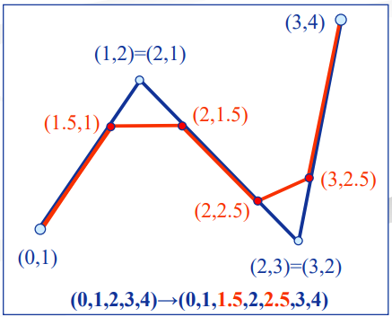
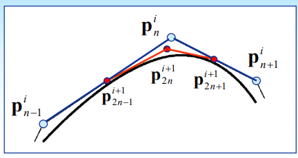
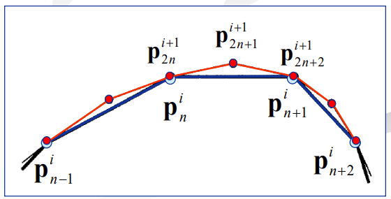
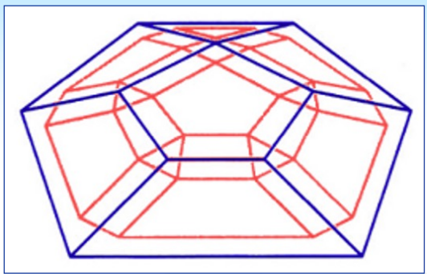
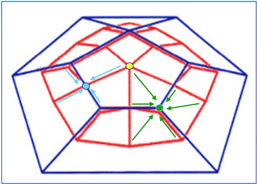
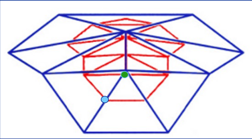

# 6. Rekurzív felosztáson alapuló felületek
Felosztásos felületek, motiváció, követelmények (11:9-10); három görbe (poligon) algoritmus:
saroklevágás (11:4), húrfelezés (11:7) és interpoláló felosztás (11:8). Három algoritmus felületekre
(poliéderekre); a felosztás elve és lépései - Doo-Sabin (11:11), Catmull-Clark (11:16), Loop (11:18). (A
súlyozási képletekre nincs szükség.)

---

### Felosztásos felületek, motiváció, követelmények

Követelmények:
- általános topológia
- lokális módosíthatóság
- egyszerű szabályok (maszk)
- hatékony algoritmus (konverzió sebessége)
- affin leképzésre invariáns
- sima felület
- hierarchikus reprezentáció
- konvex burok

### Három görbe (poligon) algoritmus: saroklevágás, húrfelezés és interpoláló felosztás

Saroklevágás

Húrfelezés

Interpoláló felosztás

### Három algoritmus felületekre (poliéderekre); a felosztás elve és lépései - Doo-Sabin, Catmull-Clark, Loop

Doo-Sabin

Catmull-Clark

Loop: háromszöghálókra
